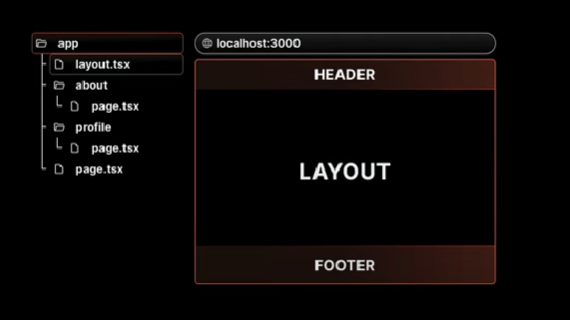
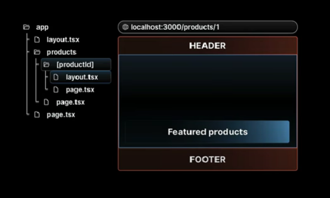
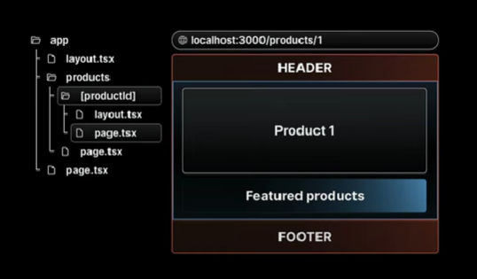
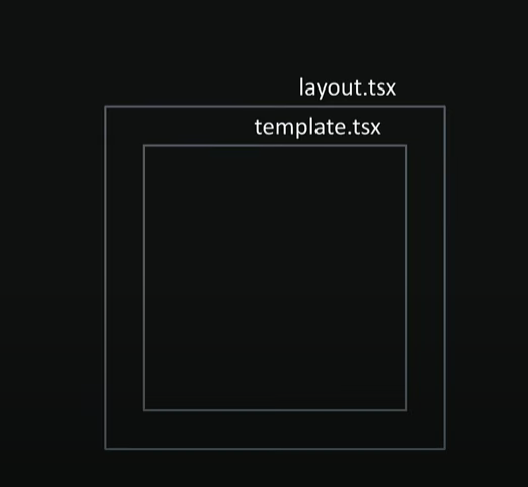
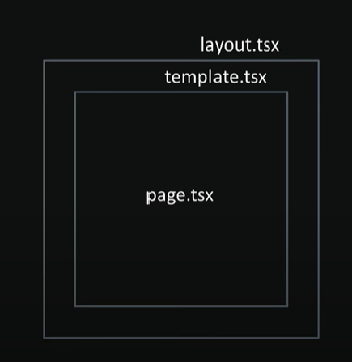

<details>
<summary><strong>📁 Route Groups in Next.js</strong></summary>

## ✅ What are Route Groups?

Route Groups in Next.js help **organize your routes and files logically** without affecting the actual **URL structure** of your app. This feature is available in the App Router (from Next.js 13+).

---

## 🧠 Why Use Route Groups?

When building features like authentication (`register`, `login`, `forgot-password`), it's a good idea to group them under a logical folder like `auth`. But if you do this directly, it affects the URL like so:

```txt
/auth/register
/auth/login
/auth/forgot-password
```

However, if you want the URLs to be clean like this:

```txt
/register
/login
/forgot-password
```

...but still want to organize files under auth, you can use Route Groups.

```bash
app/
├── (auth)/
│   ├── register/
│   │   └── page.tsx
│   ├── login/
│   │   └── page.tsx
│   └── forgot-password/
│       └── page.tsx

```

✅ Note: Wrapping the folder name with parentheses (auth) tells Next.js to use it only for organization and not include it in the route path.

</details>

<details>
<summary><strong>📁 Layouts</strong></summary>

## ✅ What are Layouts?

A layout is a **UI that is shared between multiple pages in your application**, creating a consistent structure across the entire application.

---

## 🛠️ How to Create Layouts?

- Default export a React component from a `layout.js` or `layout.tsx` file.
- That component will take a `children` prop, which Next.js will populate with your page content.
- Next.js provides one root layout by default in `app/layout.tsx`.

```tsx
// Example layout.tsx
export default function Layout({ children }: { children: React.ReactNode }) {
  return (
    <div>
      <Header />
      <main>{children}</main>
      <Footer />
    </div>
  );
}
```



</details>

<details>
<summary><strong>📁 Nested Layouts</strong></summary>

## ✅ What are Nested Layouts?

- Layouts can be nested.
- Eg: If you want a special layout for products details folder we can do that by adding a **layout.tsx/jsx** inside products details folder.
- NextJs app router supports nested layouts letting you customize different parts of your app exactly how you want to





</details>

<details>
<summary><strong>📁 Multi Root Layouts</strong></summary>

## 🎯 Scenario

Imagine you're building an application with the following pages:

- `/revenue`
- `/customers`
- `/login`
- `/register`

You want:

- `Revenue` & `Customers` to use a **full layout** with a **Header** and **Footer**.
- `Login` & `Register` to use a **minimal layout** (without header/footer).

---

## ❌ The Problem

If you define `Header` and `Footer` inside the default `app/layout.tsx`, it will be applied to **all pages**, including login and register—which you don't want.

---

## ✅ The Solution — Multi Root Layouts

Using **Route Groups** and **multiple layout.tsx files**, you can apply different root layouts to different sections of your app.

### 🧠 What Are Route Groups?

- Help organize project structure **without affecting the URL**.
- Allow you to apply layouts **selectively** to specific parts of the app.

---

## 🛠️ Steps to Implement

1. Inside the `app/` directory, create two **route groups**:

```
app/
├── (marketing)/
│ ├── layout.tsx ⬅️ Full layout (Header + Footer)
│ ├── page.tsx ⬅️ Root page (if needed)
│ ├── revenue/
│ │ └── page.tsx
│ └── customers/
│ └── page.tsx

├── (auth)/
│ ├── layout.tsx ⬅️ Minimal layout (no Header/Footer)
│ ├── login/
│ │ └── page.tsx
│ └── register/
│ └── page.tsx
```

> 📝 Parentheses around folder names like `(marketing)` or `(auth)` make them **invisible in the URL path**, but still let you organize and apply layouts.

---

## 🖼️ Folder Structure Visual


> ✅ Make sure the image is located at `public/png/MultiRootLayoutFs.png`

---

## 🔚 Result

- `/revenue` and `/customers` will use the **marketing layout** (with header and footer).
- `/login` and `/register` will use the **auth layout** (minimal).

This approach keeps your application modular, scalable, and cleanly separated by purpose.

</details>

<details>
<summary><strong>📁 Metadata (Dynamic and Static)</strong></summary>

## 📘 Overview

Next.js allows you to define both **static** and **dynamic metadata** for SEO and page titles. This metadata can be defined per route, and behaves differently depending on whether your route is a server component or a client component.

---

## ⚡ Dynamic Metadata

Dynamic metadata is useful when the metadata depends on:

- Route parameters
- External data (e.g., from an API)
- Parent segment metadata

You define dynamic metadata by **exporting a `generateMetadata()` function** from `page.tsx` or `layout.tsx`.

### 📄 Example: Dynamic Metadata in `[productId]/page.tsx`

```tsx
/**
 * @param param0
 * Receives param Props
 * @returns
 * Returns a Promise of type Metadata
 */
export const generateMetadata = async ({ params }: Props): Promise<Metadata> => {
  const id = params.productId;
  return {
    title: id,
  };
};
```

> ⚠️ You cannot use both a metadata object and a generateMetadata function in the same route segment — it's one or the other.

## 🚫 Limitation

Dynamic metadata will not work inside components marked with "use client" directive.

> Metadata cannot be generated inside a Client Components
> 

## ✅ Solution

- Keep all metadata logic inside Server Components. If a page includes both server-rendered content and client-side logic:

- Split out the client-side logic into a separate component.

- Move the "use client" code into a subcomponent like ClientCounter.tsx.

- Keep page.tsx as a server component to handle metadata.

```
app/
└── counter/
    ├── page.tsx         # Server component with metadata
    └── ClientCounter.tsx  # Client-side logic (with "use client")
```

## 🏷️ Title Metadata Options

You can define title as:

A simple string

Or an object for more control

When using the object form, you can use:

1. default — fallback title for child routes that don't define their own

2. template — define title patterns (useful for consistent suffixes/prefixes)

3. absolute — override all patterns set by parent segments

```
export const metadata: Metadata = {
  title: {
    template: "%s | MySite",
    default: "Welcome to MySite",
    absolute: "Standalone Page Title" ## Can be used in       individual page.tsx
  }
}
```

> 📝 Use absolute to break out of the inherited title formatting defined in parent layouts.

</details>

<details>
<summary><strong>📁 Navigation - Link Component (Part 1)</strong></summary>

## 🚀 Client-Side Navigation in Next.js

In Next.js, client-side navigation is handled using the built-in **`Link`** component. This improves performance by avoiding full page reloads and keeping transitions smooth.

---

## 🧭 What is the `<Link>` Component?

- The `<Link>` component is provided by **Next.js** for client-side routing.
- It wraps around an `<a>` tag under the hood and is the **primary way to navigate** between routes in a Next.js app.

---

## ✨ Features

- **Fast navigation** without reloading the page
- Can **prefetch pages** in the background
- Accepts a `replace` prop to **replace** the current history entry instead of pushing a new one

---

## 🧩 How to Use

```tsx
import Link from "next/link";

export default function Home() {
  return (
    <nav>
      <Link href="/about">About</Link>
      <Link href="/contact" replace>
        Contact
      </Link> {/* replaces current history */}
    </nav>
  );
}
```

## 🎨 Active Link Styling

To style the active link, you can use the usePathname() hook provided by next/navigation:

```tsx
"use client";

import Link from "next/link";
import { usePathname } from "next/navigation";

const NavLinks = () => {
  const pathname = usePathname();

  return (
    <nav>
      <Link href="/dashboard" className={pathname === "/dashboard" ? "text-blue-500 font-bold" : ""}>
        Dashboard
      </Link>
      <Link href="/profile" className={pathname === "/profile" ? "text-blue-500 font-bold" : ""}>
        Profile
      </Link>
    </nav>
  );
};

export default NavLinks;
```

> 💡 This helps apply active styles based on the current route.

## 📚 Summary

- Use Link from next/link for all internal navigation

- Use replace when you want to avoid adding to browser history

- Use usePathname() to highlight the currently active link

## ✅ Usage Instructions:

- You can copy-paste this into your README.md.

- The use client directive is required in the file where usePathname() is used.

- Styling can be adapted to match your CSS framework (Tailwind, CSS modules, etc.).
</details>
<details>
<summary><strong>📁 Params and Search Params (Part 2)</strong></summary>

## 🔍 What Are `params` and `searchParams`?

Given a URL, Next.js gives us access to:

- **`params`** → dynamic segments in the route (e.g. `/product/[id]`)
- **`searchParams`** → query strings in the URL (e.g. `/product?id=123&page=2`)

---

## 📂 In Server Components

You can directly access both `params` and `searchParams` in **server components** (like `page.tsx`) using `async`/`await`.

### ✅ Example: In `page.tsx`

```tsx
export default async function Page({ params, searchParams }: { params: any; searchParams: any }) {
  const id = params.id;
  const page = searchParams.page;

  return (
    <div>
      Product ID: {id} - Page: {page}
    </div>
  );
}
```

> ✅ Server components support async/await — you can use both params and searchParams directly.

## ⚛️ In Client Components

Client components do not support async/await at the component level, so you need to use React hooks like:

- useParams() – from custom or third-party hooks

- useSearchParams() – from next/navigation

### ⚠️ Hook-based access in "use client" components

```tsx
"use client";

import { useParams, useSearchParams } from "next/navigation";

export default function ClientComponent() {
  const params = useParams();
  const searchParams = useSearchParams();
  const id = params.id;
  const page = searchParams.get("page");

  return (
    <div>
      Product ID: {id} - Page: {page}
    </div>
  );
}
```

### ⚠️ Layout Limitation: No searchParams in layout.tsx

> ❗ layout.tsx files have access to params, but not to searchParams.

❗ Why?

1. Layouts are structural and static
   Layouts are meant for shared UI like headers, sidebars, footers — not dynamic data. They are rendered once and cached, so Next.js avoids passing volatile data like query strings to them.

2. **searchParams** are request-based, not route-based

   - **params** come from route segments like [id]

   - **searchParams** come from the URL query string like ?page=2

   - Since layouts don’t re-render on query changes, they can’t reliably access searchParams.

3. Performance & caching reasons

   - Layouts are heavily cached for speed.

   - Allowing searchParams would break reusability and caching optimizations.

</details>

<details>
<summary><strong>📁 Programmatic Navigation (Part 3)</strong></summary>

## 🔁 What is Programmatic Navigation?

Programmatic navigation is when you navigate to a different route **based on logic or user actions**, rather than a static `<Link>` component.

Next.js supports this in both:

- **Client Components** — via `useRouter().push()`
- **Server Components** — via `redirect()` or `notFound()`

---

## ⚛️ Client-Side Navigation (`router.push()`)

Use the `useRouter()` hook from `next/router` to navigate programmatically on the client.

### ✅ Example: Order Button with Navigation

```tsx
"use client";

import { useRouter } from "next/router";

const OrderProduct = () => {
  const router = useRouter();

  const handleClick = () => {
    console.log("Placing the order");
    router.push("/"); // navigates to home
  };

  return (
    <>
      <h1>Order Product</h1>
      <button onClick={handleClick}>Place Order</button>
    </>
  );
};

export default OrderProduct;
```

> 🔁 router.push("/path") works like a <Link> — it adds a new entry to the browser history.

## 🧠 Server-Side Navigation (redirect() and notFound())

In server components, you can't use router.push(). Instead, use:

redirect("/path") — to programmatically redirect

notFound() — to throw a 404

These come from next/navigation.

### ✅ Example: Redirecting from Dynamic Route

```tsx
import { redirect, notFound } from "next/navigation";

const ProductReviewId = async ({ params }: { params: Promise<{ productId: string; reviewId: string }> }) => {
  const { productId, reviewId } = await params;

  if (parseInt(reviewId) > 1000) {
    // notFound(); // throw 404
    redirect("/products"); // redirect to products page
  }

  return (
    <div>
      Review for {productId} with review {reviewId}
    </div>
  );
};

export default ProductReviewId;
```

> 🚨 These only work in server components — don’t use them in components marked with "use client".

## 📚 Summary

### 🧭 Feature Support: Client vs Server Component

| Feature         | Client Component (`"use client"`) | Server Component |
| --------------- | --------------------------------- | ---------------- |
| `router.push()` | ✅ Yes                            | ❌ No            |
| `redirect()`    | ❌ No                             | ✅ Yes           |
| `notFound()`    | ❌ No                             | ✅ Yes           |

## ✅ When to Use What

- Use router.push() for buttons, user actions, and dynamic client-side flows

- Use redirect() when access control or conditions must be handled during render

- Use notFound() for conditionally throwing a 404 in server logic

</details>

<details>
<summary><strong>📁 Templates</strong></summary>

## 🧩 What Are Templates in Next.js?

Templates in Next.js are similar to layouts, but with a **key difference** — they **remount** on navigation, giving you a fresh state and re-rendered DOM for every page.

---

## 🧠 Why Use Templates?

Let’s consider a scenario in your `(auth)` route group:

📁 `hello-world/src/app/(auth)/layout.tsx`

```tsx
"use client";

import Link from "next/link";
import { usePathname } from "next/navigation";
import { useState } from "react";

const navLinks = [
  { name: "Register", href: "/register" },
  { name: "Login", href: "/login" },
  { name: "Forgot Password", href: "/forgot-password" },
];

export default function AuthLayout({ children }: { children: React.ReactNode }) {
  const [input, setInput] = useState("");
  const pathName = usePathname();

  return (
    <div>
      <div>
        <input value={input} onChange={(e) => setInput(e.target.value)} />
      </div>
      {navLinks.map((link) => {
        const isActive = pathName === link.href || (pathName.startsWith(link.href) && link.href !== "/");
        return (
          <Link key={link.href} href={link.href} className={isActive ? "font-bold mr-4" : "text-red-500 mr-4"}>
            {link.name}
          </Link>
        );
      })}
      {children}
    </div>
  );
}
```

## 🧪 Scenario

When you enter something into the input box and navigate from **/register** to **/login**, the input retains its value.

> This is because layouts do not re-render or remount on navigation — only the page component inside them changes.

## 🔁 When You Need a Fresh Instance

If you want to reset the input or remount the shared UI, a layout.tsx won’t help.
This is where templates come in.

# 📄 What Are Templates?

Templates are like layouts but remount on each route navigation.

Every route sharing a template gets a fresh start:

- 🧼 DOM is recreated

- 💥 State is cleared

- 🔁 Effects are re-run (useEffects)

### How to Use

To use a template:

1. Replace `layout.tsx` with `template.tsx`

2. Export a component that accepts children prop

```tsx
export default function Template({ children }: { children: React.ReactNode }) {
  return (
    <div>
      <h1>Shared Auth Template</h1>
      {children}
    </div>
  );
}
```

> ✅ Now when you navigate between /register, /login, etc., your template (and its input state) resets each time.

## 🧩 Can You Use Layouts and Templates Together?

Yes! Layouts and templates can be used together.
Here's how it works:

1. The `layout.tsx` renders once

2. The `template.tsx` renders on every route change

3. The layout wraps the template, and the template wraps the page

### 🖼 Visual Explanation

📷 Layouts + Templates — structure:

> Note : You can actually use layout.tsx and template.tsx files together.



> In this case the layout renders first and it's children are replacedby template components ouput.(Picture below)



| Feature                 | Layouts              | Templates               |
| ----------------------- | -------------------- | ----------------------- |
| Rerender on navigation  | ❌ No                | ✅ Yes                  |
| Retains component state | ✅ Yes               | ❌ No (fresh start)     |
| Best used for           | Persistent shared UI | Shared UI needing reset |
| Caching behavior        | Aggressively cached  | Remounted fresh         |

> 💡 Use layouts for structural components like headers/footers.
> Use templates when you need per-page state reset with shared structure.

</details>

<details>
<summary><strong>📁 Loading UI (`loading.tsx`)</strong></summary>

## ⏳ What is `loading.tsx`?

Next.js provides a special file called **`loading.tsx`** to create **loading states** while a route segment is being fetched or rendered.

---

## 🧠 How It Works

- When navigating between routes, if a page or component takes time to load (due to fetching data or rendering server components), Next.js automatically shows `loading.tsx`.
- The file is colocated next to the `page.tsx` for the route.
- **Next.js automatically wraps your `page.tsx` and its children in a React Suspense boundary.**

---

## 🧩 File Placement

To use it, simply create a `loading.tsx` inside any route segment folder (like `/dashboard`, `/products`, etc.):

```bash
app/
└── dashboard/
    ├── page.tsx
    └── loading.tsx


```

## ✅ Example: loading.tsx

```tsx
export default function Loading() {
  return <p>Loading dashboard...</p>;
}
```

> This UI will appear automatically while the dashboard route is loading.

### 🎯 Benefits

- Provides better UX during route transitions

- Works seamlessly with server components and streaming

- Improves perceived performance of your app

| Feature                  | Supported |
| ------------------------ | --------- |
| Route-specific loading   | ✅ Yes    |
| Auto-wrapped in Suspense | ✅ Yes    |
| Supports nested routes   | ✅ Yes    |

> 💡 You can create loading.tsx at any route level to handle nested loading states.

</details>

<details>
<summary><strong>📁 Error Handling (Errors Part - I)</strong></summary>

## ❌ What is `error.tsx`?

Next.js allows you to define a special **`error.tsx`** file to handle unexpected errors that occur during rendering, data fetching, or inside components.

> It provides a **custom UI** for errors specific to a route segment.

---

## 🧠 How It Works

- Automatically wraps route segments and their nested children in a **React Error Boundary**
- If an error is thrown, it **only affects the segment** with the error — not the entire app
- Keeps the rest of the app functional
- Allows you to **recover from the error** without full page reload

---

## ⚛️ Important Notes

- `error.tsx` must be a **Client Component**
- Add `"use client"` at the top of the file
- It should include a `reset` function to allow retry behavior

---

## ✅ Example: `error.tsx`

```tsx
"use client";

import { useEffect } from "react";

export default function Error({ error, reset }: { error: Error; reset: () => void }) {
  useEffect(() => {
    console.error("Error caught in error.tsx:", error);
  }, [error]);

  return (
    <div>
      <h2>Something went wrong!</h2>
      <button onClick={() => reset()}>Try Again</button>
    </div>
  );
}
```

## 📁 Folder Structure

```bash
app/
└── [reviewId]/
    ├── page.tsx
    ├── error.tsx
```

> The error.tsx here will only handle errors in the /reviewId segment.

# 🖼️ Component Hierarchy Visual


| Feature                    | Supported |
| -------------------------- | --------- |
| Per-route error boundaries | ✅ Yes    |
| Isolates segment errors    | ✅ Yes    |
| Recovery using `reset()`   | ✅ Yes    |
| Must be a client component | ✅ Yes    |
| Works with nested routing  | ✅ Yes    |

> 💡 For global error handling, use app/global-error.tsx (optional fallback for unhandled cases).
</details>

<details>
<summary><strong>📁 Recovering From Errors (Error Handling - Part II)</strong></summary>

## 🔁 Recovering from Errors in `error.tsx`

Next.js error boundaries (`error.tsx`) provide a powerful way to **gracefully handle rendering errors** in route segments.  
One useful prop passed to this component is the **`reset()`** function.

---

## 🧪 Basic Recovery with `reset()`

```tsx
'use client';

const ErrorBoundary = ({ error, reset }: { error: Error; reset: () => void }) => {
  return (
    <div>
      <p>{error.message}</p>
      <button onClick={() => reset()}>Try again</button>
    </div>
  );
};

export default ErrorBoundary;
```

- The reset() function allows the component tree to re-render and re-attempt the logic that previously failed.

- However, if the error is on the server, clicking "Try Again" will keep showing the same error.

## 🧠 Why Doesn't reset() Always Work?
- `reset()` works only for client-side errors or transient UI glitches.

- For server-side rendering errors, the component still fails unless we refresh the route or reload the server-side context.

```tsx
'use client';

import { useRouter } from 'next/navigation';
import { startTransition } from 'react';

const ErrorBoundary = ({ error, reset }: { error: Error; reset: () => void }) => {
  const router = useRouter();

  const reload = () => {
    startTransition(() => {
      router.refresh(); // revalidate the server component
      reset();           // re-attempt rendering
    });
  };

  return (
    <div>
      <p>{error.message}</p>
      <button onClick={reload}>Try again</button>
    </div>
  );
};

export default ErrorBoundary;
```

### ✅ Why Use startTransition()?
- Defers the route refresh until the next render phase

- Ensures smoother experience while React handles any pending state updates

- Prevents UI from freezing or glitching during retries

| Technique           | Works For          | What It Does                           |
| ------------------- | ------------------ | -------------------------------------- |
| `reset()`           | Client-only errors | Re-renders component tree              |
| `router.refresh()`  | Server errors      | Refetches and revalidates server logic |
| `startTransition()` | UI performance     | Defers updates for smoother retry UX   |
>💡 For full error resilience, combine both reset() and router.refresh() inside a transition.
</details>


<details>
<summary><strong>📁 Handling Errors in Nested Routes (Error Handling - Part III)</strong></summary>

## 🧱 How Do Nested Error Boundaries Work?

When an error occurs in a route segment, **Next.js will bubble the error up** to the **nearest `error.tsx` file** in the route hierarchy — just like how React error boundaries work.

---

## 🔍 Key Concepts

- An `error.tsx` handles errors **for its own folder AND all nested child segments**.
- Errors "bubble up" to the nearest available `error.tsx` file.
- This allows you to **control the scope of error handling** by placing `error.tsx` files at different folder levels.

---

## 📁 Example Scenario

Assume we have the following structure:

```bash
app/
└── products/
    ├── page.tsx
    ├── error.tsx        ← catches errors in all nested segments
    └── [productId]/
        ├── page.tsx
        └── reviewId/
            ├── page.tsx
            └── error.tsx (optional override)
```
## Case 1: error.tsx inside reviewId/
Catches errors only in the reviewId segment.

Other parts of products remain unaffected.

## Case 2: error.tsx moved to products/
Now handles errors for:

`/products`

`/products/[productId]`

`/products/[productId]/reviewId`

Any error from children bubbles up to this `error.tsx`.

##  Why Does Placement Matter?
"Where you place your error.tsx determines how localized or global your error handling is."

| Location              | Error Scope                                    |
| --------------------- | ---------------------------------------------- |
| `reviewId/error.tsx`  | Only errors inside `reviewId/`                 |
| `productId/error.tsx` | Catches errors in productId and its children   |
| `products/error.tsx`  | Handles errors across the entire products tree |
### ✅ Best Practices
- Use deep-level error.tsx when you want granular, component-specific fallback UIs

- Use higher-level error.tsx when you want centralized error handling (e.g., show a full-page error for product-related failures)

- You can combine both! A deep-level error.tsx will override the parent's behavior.
</details>