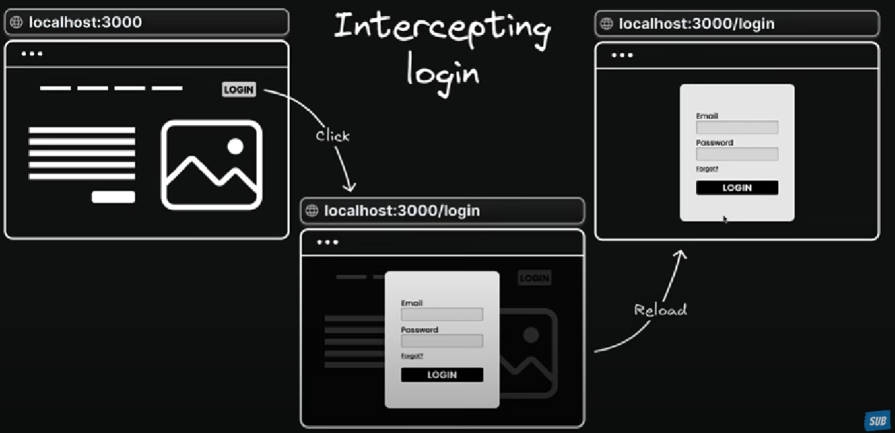
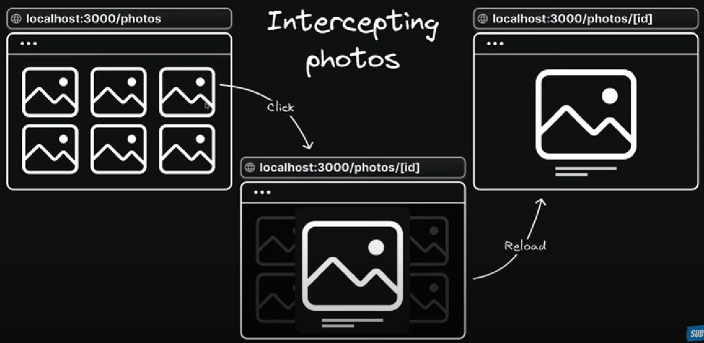
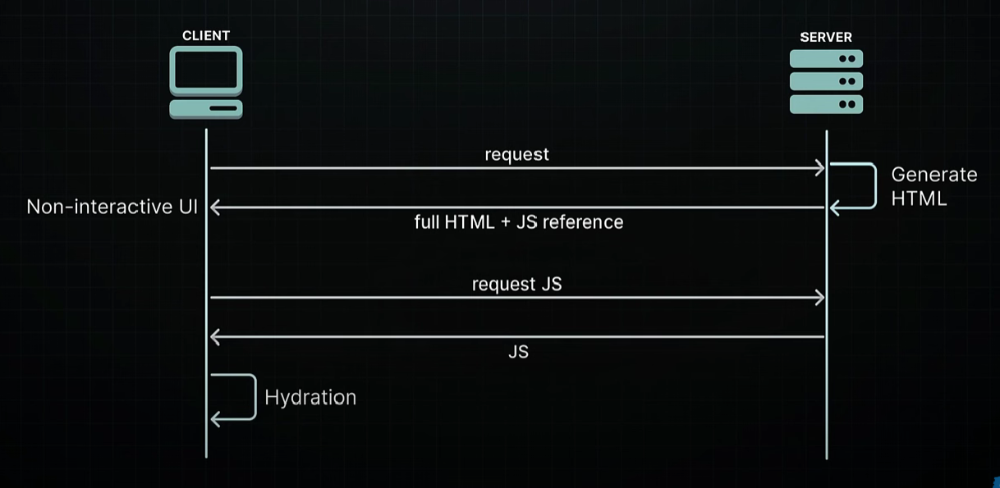
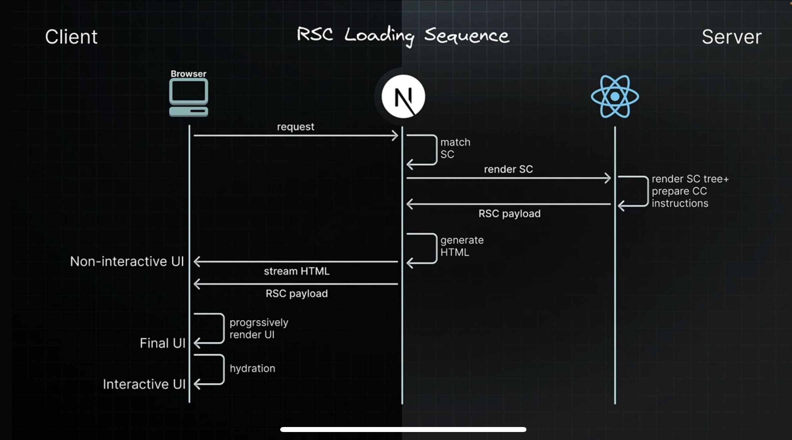

<details>
<summary><strong>📁 Multiple Root Layouts</strong></summary>

### 🧩 Route Group Usage

Organize your project structure without affecting URLs.  
Apply layouts selectively to specific parts of the application.

### 🛠️ Steps

Create two route groups in the `app` folder:

```bash
app/
├── (marketing)/
│   ├── customers/
│   └── revenue/     ← move root layout here
└── (auth)/
├── login/
└── register/    ← create root layout here
```

Multiple Root Layouts allow you to apply different layouts to specific parts of your application.

</details>


<details>
<summary><strong>🔖 Routing Metadata</strong></summary>

### 🌐 SEO & How Next.js Helps

The Metadata API in Next.js is a powerful feature that lets us define metadata for each page.  
Metadata ensures the content looks **great** when it's shared or indexed by search engines.

### 📌 Ways to Handle Metadata

1. Export a static metadata object.
2. Generate dynamic metadata using the `generateMetadata` function.

</details>


<details>
<summary><strong>⚙️ Configuring Metadata</strong></summary>

### 📝 Metadata Rules

- Both `layout.tsx` and `page.tsx` can export metadata.
- Layout metadata applies to all its pages.
- Page metadata is specific to the individual page.
- It follows a top-down order, starting from the **root-level** layout.

</details>

<details>
<summary><strong>📁 Route Groups in Next.js</strong></summary>

## ✅ What are Route Groups?

Route Groups in Next.js help **organize your routes and files logically** without affecting the actual **URL structure** of your app. This feature is available in the App Router (from Next.js 13+).

---

## 🧠 Why Use Route Groups?

When building features like authentication (`register`, `login`, `forgot-password`), it's a good idea to group them under a logical folder like `auth`. But if you do this directly, it affects the URL like so:

```txt
/auth/register
/auth/login
/auth/forgot-password
```

However, if you want the URLs to be clean like this:

```txt
/register
/login
/forgot-password
```

...but still want to organize files under auth, you can use Route Groups.

```bash
app/
├── (auth)/
│   ├── register/
│   │   └── page.tsx
│   ├── login/
│   │   └── page.tsx
│   └── forgot-password/
│       └── page.tsx

```

✅ Note: Wrapping the folder name with parentheses (auth) tells Next.js to use it only for organization and not include it in the route path.

</details>

<details>
<summary><strong>📁 Layouts</strong></summary>

## ✅ What are Layouts?

A layout is a **UI that is shared between multiple pages in your application**, creating a consistent structure across the entire application.

---

## 🛠️ How to Create Layouts?

- Default export a React component from a `layout.js` or `layout.tsx` file.
- That component will take a `children` prop, which Next.js will populate with your page content.
- Next.js provides one root layout by default in `app/layout.tsx`.

```tsx
// Example layout.tsx
export default function Layout({ children }: { children: React.ReactNode }) {
  return (
    <div>
      <Header />
      <main>{children}</main>
      <Footer />
    </div>
  );
}
```


</details>

<details>
<summary><strong>📁 Nested Layouts</strong></summary>

## ✅ What are Nested Layouts?

- Layouts can be nested.
- Eg: If you want a special layout for products details folder we can do that by adding a **layout.tsx/jsx** inside products details folder.
- NextJs app router supports nested layouts letting you customize different parts of your app exactly how you want to


</details>

<details>
<summary><strong>📁 Multi Root Layouts</strong></summary>

## 🎯 Scenario

Imagine you're building an application with the following pages:

- `/revenue`
- `/customers`
- `/login`
- `/register`

You want:

- `Revenue` & `Customers` to use a **full layout** with a **Header** and **Footer**.
- `Login` & `Register` to use a **minimal layout** (without header/footer).

---

## ❌ The Problem

If you define `Header` and `Footer` inside the default `app/layout.tsx`, it will be applied to **all pages**, including login and register—which you don't want.

---

## ✅ The Solution — Multi Root Layouts

Using **Route Groups** and **multiple layout.tsx files**, you can apply different root layouts to different sections of your app.

### 🧠 What Are Route Groups?

- Help organize project structure **without affecting the URL**.
- Allow you to apply layouts **selectively** to specific parts of the app.

---

## 🛠️ Steps to Implement

1. Inside the `app/` directory, create two **route groups**:

```
app/
├── (marketing)/
│ ├── layout.tsx ⬅️ Full layout (Header + Footer)
│ ├── page.tsx ⬅️ Root page (if needed)
│ ├── revenue/
│ │ └── page.tsx
│ └── customers/
│ └── page.tsx

├── (auth)/
│ ├── layout.tsx ⬅️ Minimal layout (no Header/Footer)
│ ├── login/
│ │ └── page.tsx
│ └── register/
│ └── page.tsx
```

> 📝 Parentheses around folder names like `(marketing)` or `(auth)` make them **invisible in the URL path**, but still let you organize and apply layouts.

---

## 🖼️ Folder Structure Visual


> ✅ Make sure the image is located at `public/png/MultiRootLayoutFs.png`

---

## 🔚 Result

- `/revenue` and `/customers` will use the **marketing layout** (with header and footer).
- `/login` and `/register` will use the **auth layout** (minimal).

This approach keeps your application modular, scalable, and cleanly separated by purpose.

</details>

<details>
<summary><strong>📁 Metadata (Dynamic and Static)</strong></summary>

## 📘 Overview

Next.js allows you to define both **static** and **dynamic metadata** for SEO and page titles. This metadata can be defined per route, and behaves differently depending on whether your route is a server component or a client component.

---

## ⚡ Dynamic Metadata

Dynamic metadata is useful when the metadata depends on:

- Route parameters
- External data (e.g., from an API)
- Parent segment metadata

You define dynamic metadata by **exporting a `generateMetadata()` function** from `page.tsx` or `layout.tsx`.

### 📄 Example: Dynamic Metadata in `[productId]/page.tsx`

```tsx
/**
 * @param param0
 * Receives param Props
 * @returns
 * Returns a Promise of type Metadata
 */
export const generateMetadata = async ({ params }: Props): Promise<Metadata> => {
  const id = params.productId;
  return {
    title: id,
  };
};
```

> ⚠️ You cannot use both a metadata object and a generateMetadata function in the same route segment — it's one or the other.

## 🚫 Limitation

Dynamic metadata will not work inside components marked with "use client" directive.

> Metadata cannot be generated inside a Client Components
> 

## ✅ Solution

- Keep all metadata logic inside Server Components. If a page includes both server-rendered content and client-side logic:

- Split out the client-side logic into a separate component.

- Move the "use client" code into a subcomponent like ClientCounter.tsx.

- Keep page.tsx as a server component to handle metadata.

```
app/
└── counter/
    ├── page.tsx         # Server component with metadata
    └── ClientCounter.tsx  # Client-side logic (with "use client")
```

## 🏷️ Title Metadata Options

You can define title as:

A simple string

Or an object for more control

When using the object form, you can use:

1. default — fallback title for child routes that don't define their own

2. template — define title patterns (useful for consistent suffixes/prefixes)

3. absolute — override all patterns set by parent segments

```
export const metadata: Metadata = {
  title: {
    template: "%s | MySite",
    default: "Welcome to MySite",
    absolute: "Standalone Page Title" ## Can be used in       individual page.tsx
  }
}
```

> 📝 Use absolute to break out of the inherited title formatting defined in parent layouts.

</details>

<details>
<summary><strong>📁 Navigation - Link Component (Part 1)</strong></summary>

## 🚀 Client-Side Navigation in Next.js

In Next.js, client-side navigation is handled using the built-in **`Link`** component. This improves performance by avoiding full page reloads and keeping transitions smooth.

---

## 🧭 What is the `<Link>` Component?

- The `<Link>` component is provided by **Next.js** for client-side routing.
- It wraps around an `<a>` tag under the hood and is the **primary way to navigate** between routes in a Next.js app.

---

## ✨ Features

- **Fast navigation** without reloading the page
- Can **prefetch pages** in the background
- Accepts a `replace` prop to **replace** the current history entry instead of pushing a new one

---

## 🧩 How to Use

```tsx
import Link from "next/link";

export default function Home() {
  return (
    <nav>
      <Link href="/about">About</Link>
      <Link href="/contact" replace>
        Contact
      </Link> {/* replaces current history */}
    </nav>
  );
}
```

## 🎨 Active Link Styling

To style the active link, you can use the usePathname() hook provided by next/navigation:

```tsx
"use client";

import Link from "next/link";
import { usePathname } from "next/navigation";

const NavLinks = () => {
  const pathname = usePathname();

  return (
    <nav>
      <Link href="/dashboard" className={pathname === "/dashboard" ? "text-blue-500 font-bold" : ""}>
        Dashboard
      </Link>
      <Link href="/profile" className={pathname === "/profile" ? "text-blue-500 font-bold" : ""}>
        Profile
      </Link>
    </nav>
  );
};

export default NavLinks;
```

> 💡 This helps apply active styles based on the current route.

## 📚 Summary

- Use Link from next/link for all internal navigation

- Use replace when you want to avoid adding to browser history

- Use usePathname() to highlight the currently active link

## ✅ Usage Instructions:

- You can copy-paste this into your README.md.

- The use client directive is required in the file where usePathname() is used.

- Styling can be adapted to match your CSS framework (Tailwind, CSS modules, etc.).
</details>
<details>
<summary><strong>📁 Params and Search Params (Part 2)</strong></summary>

## 🔍 What Are `params` and `searchParams`?

Given a URL, Next.js gives us access to:

- **`params`** → dynamic segments in the route (e.g. `/product/[id]`)
- **`searchParams`** → query strings in the URL (e.g. `/product?id=123&page=2`)

---

## 📂 In Server Components

You can directly access both `params` and `searchParams` in **server components** (like `page.tsx`) using `async`/`await`.

### ✅ Example: In `page.tsx`

```tsx
export default async function Page({ params, searchParams }: { params: any; searchParams: any }) {
  const id = params.id;
  const page = searchParams.page;

  return (
    <div>
      Product ID: {id} - Page: {page}
    </div>
  );
}
```

> ✅ Server components support async/await — you can use both params and searchParams directly.

## ⚛️ In Client Components

Client components do not support async/await at the component level, so you need to use React hooks like:

- useParams() – from custom or third-party hooks

- useSearchParams() – from next/navigation

### ⚠️ Hook-based access in "use client" components

```tsx
"use client";

import { useParams, useSearchParams } from "next/navigation";

export default function ClientComponent() {
  const params = useParams();
  const searchParams = useSearchParams();
  const id = params.id;
  const page = searchParams.get("page");

  return (
    <div>
      Product ID: {id} - Page: {page}
    </div>
  );
}
```

### ⚠️ Layout Limitation: No searchParams in layout.tsx

> ❗ layout.tsx files have access to params, but not to searchParams.

❗ Why?

1. Layouts are structural and static
   Layouts are meant for shared UI like headers, sidebars, footers — not dynamic data. They are rendered once and cached, so Next.js avoids passing volatile data like query strings to them.

2. **searchParams** are request-based, not route-based

   - **params** come from route segments like [id]

   - **searchParams** come from the URL query string like ?page=2

   - Since layouts don’t re-render on query changes, they can’t reliably access searchParams.

3. Performance & caching reasons

   - Layouts are heavily cached for speed.

   - Allowing searchParams would break reusability and caching optimizations.

</details>

<details>
<summary><strong>📁 Programmatic Navigation (Part 3)</strong></summary>

## 🔁 What is Programmatic Navigation?

Programmatic navigation is when you navigate to a different route **based on logic or user actions**, rather than a static `<Link>` component.

Next.js supports this in both:

- **Client Components** — via `useRouter().push()`
- **Server Components** — via `redirect()` or `notFound()`

---

## ⚛️ Client-Side Navigation (`router.push()`)

Use the `useRouter()` hook from `next/router` to navigate programmatically on the client.

### ✅ Example: Order Button with Navigation

```tsx
"use client";

import { useRouter } from "next/router";

const OrderProduct = () => {
  const router = useRouter();

  const handleClick = () => {
    console.log("Placing the order");
    router.push("/"); // navigates to home
  };

  return (
    <>
      <h1>Order Product</h1>
      <button onClick={handleClick}>Place Order</button>
    </>
  );
};

export default OrderProduct;
```

> 🔁 router.push("/path") works like a <Link> — it adds a new entry to the browser history.

## 🧠 Server-Side Navigation (redirect() and notFound())

In server components, you can't use router.push(). Instead, use:

redirect("/path") — to programmatically redirect

notFound() — to throw a 404

These come from next/navigation.

### ✅ Example: Redirecting from Dynamic Route

```tsx
import { redirect, notFound } from "next/navigation";

const ProductReviewId = async ({ params }: { params: Promise<{ productId: string; reviewId: string }> }) => {
  const { productId, reviewId } = await params;

  if (parseInt(reviewId) > 1000) {
    // notFound(); // throw 404
    redirect("/products"); // redirect to products page
  }

  return (
    <div>
      Review for {productId} with review {reviewId}
    </div>
  );
};

export default ProductReviewId;
```

> 🚨 These only work in server components — don’t use them in components marked with "use client".

## 📚 Summary

### 🧭 Feature Support: Client vs Server Component

| Feature         | Client Component (`"use client"`) | Server Component |
| --------------- | --------------------------------- | ---------------- |
| `router.push()` | ✅ Yes                            | ❌ No            |
| `redirect()`    | ❌ No                             | ✅ Yes           |
| `notFound()`    | ❌ No                             | ✅ Yes           |

## ✅ When to Use What

- Use router.push() for buttons, user actions, and dynamic client-side flows

- Use redirect() when access control or conditions must be handled during render

- Use notFound() for conditionally throwing a 404 in server logic

</details>

<details>
<summary><strong>📁 Templates</strong></summary>

## 🧩 What Are Templates in Next.js?

Templates in Next.js are similar to layouts, but with a **key difference** — they **remount** on navigation, giving you a fresh state and re-rendered DOM for every page.

---

## 🧠 Why Use Templates?

Let’s consider a scenario in your `(auth)` route group:

📁 `hello-world/src/app/(auth)/layout.tsx`

```tsx
"use client";

import Link from "next/link";
import { usePathname } from "next/navigation";
import { useState } from "react";

const navLinks = [
  { name: "Register", href: "/register" },
  { name: "Login", href: "/login" },
  { name: "Forgot Password", href: "/forgot-password" },
];

export default function AuthLayout({ children }: { children: React.ReactNode }) {
  const [input, setInput] = useState("");
  const pathName = usePathname();

  return (
    <div>
      <div>
        <input value={input} onChange={(e) => setInput(e.target.value)} />
      </div>
      {navLinks.map((link) => {
        const isActive = pathName === link.href || (pathName.startsWith(link.href) && link.href !== "/");
        return (
          <Link key={link.href} href={link.href} className={isActive ? "font-bold mr-4" : "text-red-500 mr-4"}>
            {link.name}
          </Link>
        );
      })}
      {children}
    </div>
  );
}
```

## 🧪 Scenario

When you enter something into the input box and navigate from **/register** to **/login**, the input retains its value.

> This is because layouts do not re-render or remount on navigation — only the page component inside them changes.

## 🔁 When You Need a Fresh Instance

If you want to reset the input or remount the shared UI, a layout.tsx won’t help.
This is where templates come in.

# 📄 What Are Templates?

Templates are like layouts but remount on each route navigation.

Every route sharing a template gets a fresh start:

- 🧼 DOM is recreated

- 💥 State is cleared

- 🔁 Effects are re-run (useEffects)

### How to Use

To use a template:

1. Replace `layout.tsx` with `template.tsx`

2. Export a component that accepts children prop

```tsx
export default function Template({ children }: { children: React.ReactNode }) {
  return (
    <div>
      <h1>Shared Auth Template</h1>
      {children}
    </div>
  );
}
```

> ✅ Now when you navigate between /register, /login, etc., your template (and its input state) resets each time.

## 🧩 Can You Use Layouts and Templates Together?

Yes! Layouts and templates can be used together.
Here's how it works:

1. The `layout.tsx` renders once

2. The `template.tsx` renders on every route change

3. The layout wraps the template, and the template wraps the page

### 🖼 Visual Explanation

📷 Layouts + Templates — structure:

> Note : You can actually use layout.tsx and template.tsx files together.


> In this case the layout renders first and it's children are replacedby template components ouput.(Picture below)


| Feature                 | Layouts              | Templates               |
| ----------------------- | -------------------- | ----------------------- |
| Rerender on navigation  | ❌ No                | ✅ Yes                  |
| Retains component state | ✅ Yes               | ❌ No (fresh start)     |
| Best used for           | Persistent shared UI | Shared UI needing reset |
| Caching behavior        | Aggressively cached  | Remounted fresh         |

> 💡 Use layouts for structural components like headers/footers.
> Use templates when you need per-page state reset with shared structure.

</details>

<details>
<summary><strong>📁 Loading UI (`loading.tsx`)</strong></summary>

## ⏳ What is `loading.tsx`?

Next.js provides a special file called **`loading.tsx`** to create **loading states** while a route segment is being fetched or rendered.

---

## 🧠 How It Works

- When navigating between routes, if a page or component takes time to load (due to fetching data or rendering server components), Next.js automatically shows `loading.tsx`.
- The file is colocated next to the `page.tsx` for the route.
- **Next.js automatically wraps your `page.tsx` and its children in a React Suspense boundary.**

---

## 🧩 File Placement

To use it, simply create a `loading.tsx` inside any route segment folder (like `/dashboard`, `/products`, etc.):

```bash
app/
└── dashboard/
    ├── page.tsx
    └── loading.tsx


```

## ✅ Example: loading.tsx

```tsx
export default function Loading() {
  return <p>Loading dashboard...</p>;
}
```

> This UI will appear automatically while the dashboard route is loading.

### 🎯 Benefits

- Provides better UX during route transitions

- Works seamlessly with server components and streaming

- Improves perceived performance of your app

| Feature                  | Supported |
| ------------------------ | --------- |
| Route-specific loading   | ✅ Yes    |
| Auto-wrapped in Suspense | ✅ Yes    |
| Supports nested routes   | ✅ Yes    |

> 💡 You can create loading.tsx at any route level to handle nested loading states.

</details>

<details>
<summary><strong>📁 Error Handling (Error Handling - Part I)</strong></summary>

## ❌ What is `error.tsx`?

Next.js allows you to define a special **`error.tsx`** file to handle unexpected errors that occur during rendering, data fetching, or inside components.

> It provides a **custom UI** for errors specific to a route segment.

---

## 🧠 How It Works

- Automatically wraps route segments and their nested children in a **React Error Boundary**
- If an error is thrown, it **only affects the segment** with the error — not the entire app
- Keeps the rest of the app functional
- Allows you to **recover from the error** without full page reload

---

## ⚛️ Important Notes

- `error.tsx` must be a **Client Component**
- Add `"use client"` at the top of the file
- It should include a `reset` function to allow retry behavior

---

## ✅ Example: `error.tsx`

```tsx
"use client";

import { useEffect } from "react";

export default function Error({ error, reset }: { error: Error; reset: () => void }) {
  useEffect(() => {
    console.error("Error caught in error.tsx:", error);
  }, [error]);

  return (
    <div>
      <h2>Something went wrong!</h2>
      <button onClick={() => reset()}>Try Again</button>
    </div>
  );
}
```

## 📁 Folder Structure

```bash
app/
└── [reviewId]/
    ├── page.tsx
    ├── error.tsx
```

> The error.tsx here will only handle errors in the /reviewId segment.

# 🖼️ Component Hierarchy Visual


| Feature                    | Supported |
| -------------------------- | --------- |
| Per-route error boundaries | ✅ Yes    |
| Isolates segment errors    | ✅ Yes    |
| Recovery using `reset()`   | ✅ Yes    |
| Must be a client component | ✅ Yes    |
| Works with nested routing  | ✅ Yes    |

> 💡 For global error handling, use app/global-error.tsx (optional fallback for unhandled cases).

</details>

<details>
<summary><strong>📁 Recovering From Errors (Error Handling - Part II)</strong></summary>

## 🔁 Recovering from Errors in `error.tsx`

Next.js error boundaries (`error.tsx`) provide a powerful way to **gracefully handle rendering errors** in route segments.  
One useful prop passed to this component is the **`reset()`** function.

---

## 🧪 Basic Recovery with `reset()`

```tsx
"use client";

const ErrorBoundary = ({ error, reset }: { error: Error; reset: () => void }) => {
  return (
    <div>
      <p>{error.message}</p>
      <button onClick={() => reset()}>Try again</button>
    </div>
  );
};

export default ErrorBoundary;
```

- The reset() function allows the component tree to re-render and re-attempt the logic that previously failed.

- However, if the error is on the server, clicking "Try Again" will keep showing the same error.

## 🧠 Why Doesn't reset() Always Work?

- `reset()` works only for client-side errors or transient UI glitches.

- For server-side rendering errors, the component still fails unless we refresh the route or reload the server-side context.

```tsx
"use client";

import { useRouter } from "next/navigation";
import { startTransition } from "react";

const ErrorBoundary = ({ error, reset }: { error: Error; reset: () => void }) => {
  const router = useRouter();

  const reload = () => {
    startTransition(() => {
      router.refresh(); // revalidate the server component
      reset(); // re-attempt rendering
    });
  };

  return (
    <div>
      <p>{error.message}</p>
      <button onClick={reload}>Try again</button>
    </div>
  );
};

export default ErrorBoundary;
```

### ✅ Why Use startTransition()?

- Defers the route refresh until the next render phase

- Ensures smoother experience while React handles any pending state updates

- Prevents UI from freezing or glitching during retries

| Technique           | Works For          | What It Does                           |
| ------------------- | ------------------ | -------------------------------------- |
| `reset()`           | Client-only errors | Re-renders component tree              |
| `router.refresh()`  | Server errors      | Refetches and revalidates server logic |
| `startTransition()` | UI performance     | Defers updates for smoother retry UX   |

> 💡 For full error resilience, combine both reset() and router.refresh() inside a transition.

</details>

<details>
<summary><strong>📁 Handling Errors in Nested Routes (Error Handling - Part III)</strong></summary>

## 🧱 How Do Nested Error Boundaries Work?

When an error occurs in a route segment, **Next.js will bubble the error up** to the **nearest `error.tsx` file** in the route hierarchy — just like how React error boundaries work.

---

## 🔍 Key Concepts

- An `error.tsx` handles errors **for its own folder AND all nested child segments**.
- Errors "bubble up" to the nearest available `error.tsx` file.
- This allows you to **control the scope of error handling** by placing `error.tsx` files at different folder levels.

---

## 📁 Example Scenario

Assume we have the following structure:

```bash
app/
└── products/
    ├── page.tsx
    ├── error.tsx        ← catches errors in all nested segments
    └── [productId]/
        ├── page.tsx
        └── reviewId/
            ├── page.tsx
            └── error.tsx (optional override)
```

## Case 1: error.tsx inside reviewId/

Catches errors only in the reviewId segment.

Other parts of products remain unaffected.

## Case 2: error.tsx moved to products/

Now handles errors for:

`/products`

`/products/[productId]`

`/products/[productId]/reviewId`

Any error from children bubbles up to this `error.tsx`.

## Why Does Placement Matter?

"Where you place your error.tsx determines how localized or global your error handling is."

| Location              | Error Scope                                    |
| --------------------- | ---------------------------------------------- |
| `reviewId/error.tsx`  | Only errors inside `reviewId/`                 |
| `productId/error.tsx` | Catches errors in productId and its children   |
| `products/error.tsx`  | Handles errors across the entire products tree |

### ✅ Best Practices

- Use deep-level error.tsx when you want granular, component-specific fallback UIs

- Use higher-level error.tsx when you want centralized error handling (e.g., show a full-page error for product-related failures)

- You can combine both! A deep-level error.tsx will override the parent's behavior.
</details>
<details><summary><strong>
📁 Handling Errors in Layouts (Error Handling - Part IV)</strong></summary>

The error boundary wont catch errors thrown in `layout.tsx` within the same segement because of how component hierarchy works.

The layout actually sits above the error boundary in a component tree


</details>

<details>
<summary><strong>📁 Handling Global Errors (Error Handling - Part V)</strong></summary>

## 🌐 What is `global-error.tsx`?

Next.js provides a **special file** named `global-error.tsx` to catch **top-level application errors** — it's the **last line of defense** when everything else fails.

Place this file in your app root:

```bash
app/
└── global-error.tsx
```

| Property        | Behavior                                        |
| --------------- | ----------------------------------------------- |
| Location        | Root `app/` directory                           |
| Scope           | Catches uncaught top-level errors               |
| Works in        | ✅ Production only (`next build && next start`) |
| Dev behavior    | ❌ Shows Next.js overlay error instead          |
| HTML structure  | ✅ Requires its own `<html>` and `<body>` tags  |
| Replaces layout | ✅ Fully replaces the root layout               |

## ⚛️ Why Include `<html>` and `<body>`?

When `global-error.tsx` is triggered, it completely replaces the layout, not just the page content. So:

You must return a full HTML document

Include `<html>` and `<body>` tags (like in `layout.tsx`)

## ✅ Example: `global-error.tsx`

```tsx
"use client"; // Error boundaries must be Client Components

import "./globals.css";

export default function GlobalError() {
  return (
    <html lang="en">
      <body>
        <div className="flex flex-col items-center justify-center min-h-screen">
          <h2 className="text-2xl font-bold mb-4">Something went wrong!</h2>
          <button
            onClick={() => {
              // refresh the page
              window.location.reload();
            }}
            className="bg-blue-500 hover:bg-blue-700 text-white font-bold py-2 px-4 rounded"
          >
            Refresh
          </button>
        </div>
      </body>
    </html>
  );
}
```

> 🔁 reset() can attempt to recover the app state — though often not useful at global level.

## 🛠 Dev Mode Behavior

In development mode, you’ll still see the Next.js error overlay instead of your global-error.tsx file.

This is intentional to help developers debug errors faster during development.

| Feature                    | Supported |
| -------------------------- | --------- |
| Handles top-level crashes  | ✅ Yes    |
| Requires HTML/Body tags    | ✅ Yes    |
| Renders in production only | ✅ Yes    |
| Replaces root layout       | ✅ Yes    |

> 💡 global-error.tsx ensures your app fails gracefully in production when all other boundaries are bypassed.

</details>

<details>
<summary><strong>📁 Parallel Routes in Next.js</strong></summary>

## 🔄 What Are Parallel Routes?

**Parallel routes** let you render **multiple pages simultaneously** within the same layout.  
They are especially useful for **dashboards** or **multi-pane UIs**, where different sections need to be independently rendered.

---

## 🧠 Concept: Slots

Parallel routes are powered by a feature called **`slots`**.

- A **slot** is a route segment prefixed with `@`
- Each slot becomes a **prop** in the corresponding `layout.tsx` file
- They help modularize complex layouts without affecting the URL

---

## 📁 Scenario: Complex Dashboard

Imagine you're building a dashboard that displays:

1. 📊 User Analytics
2. 💰 Revenue Metrics
3. 🔔 Notifications

With **parallel routing**, you can create:

```bash
app/
└── dashboard/
    ├── layout.tsx
    ├── @user/          ← Slot for analytics
    ├── @revenue/       ← Slot for revenue
    └── @notifications/ ← Slot for notifications
```

> Each @slot will render in a different region of the layout.tsx using props like user, revenue, notifications.

### Folder Structure


### 💡 Key Notes

- Slots are not part of the URL

- The default children prop is also a slot (but doesn't need its own folder)

- Slots make layouts modular and composable

## ✨ Benefits of Parallel Routes

| Feature                    | Benefit                                               |
| -------------------------- | ----------------------------------------------------- |
| Modular Layout             | Separate concerns into dedicated route segments       |
| Independent Route Handling | Each slot can have its own `loading.tsx`, `error.tsx` |
| Better Performance         | Lazy loading of sections based on user interaction    |
| Sub-navigation Support     | Each slot can have its own navigation and UI state    |

## 🧩 Independent Route Handling

Each slot can define:

- `loading.tsx` for loading states

- `error.tsx` for error boundaries

This gives fine-grained control over how each section behaves.

> Each slot in layout can handle it's own loading and error states
> This granular control is particularly useful in scenarios where different sections of the page load at varying speeds or encounter unique errors

### 📷 Example: Separate loading/error handling for slots


## 🔀 Sub-navigation Support

Each slot can behave like a mini-app:

- Have its own routes

- Handle navigation, state, filters independently

- No interference between slots

### 📷 Example: Sub-navigation in slots


## Summary

| Concept          | Description                                   |
| ---------------- | --------------------------------------------- |
| Slot (`@name`)   | Custom segment rendered as a layout prop      |
| Parallel Routing | Render multiple routes inside the same layout |
| URL Structure    | Unaffected (slots are invisible in URLs)      |
| Use Case         | Dashboards, split views, complex admin panels |

> 💡 Parallel routing + slots = super flexible and performant UI composition in Next.js.

</details>

<details>
<summary><strong>📁 Handling Unmatched Routes in Parallel Routing</strong></summary>

## 🚧 What Are Unmatched Slots?

In a parallel routing setup (using `@slots`), each slot renders content **based on the current URL**. But when a slot **doesn’t match** the URL, it becomes an **unmatched slot**.

---

## 📁 Scenario: Complex Dashboard with 4 Slots

Let's say we have a parallel layout at `/complex-dashboard` with these slots:

- `@children` → Main view
- `@users` → User Analytics
- `@revenue` → Revenue Metrics
- `@notifications` → Notifications

```bash
app/
└── complex-dashboard/
    ├── layout.tsx
    ├── @users/
    ├── @revenue/
    ├── @notifications/
    └── page.tsx (children slot)
```

## 🧭 Route Behavior

### ✅ Navigating to /complex-dashboard

All slots are matched and display:

- Main view (children)

- Users panel

- Revenue panel

- Notifications panel

## ❗ Navigating to /complex-dashboard/archived

Suppose only the @notifications slot has content for /archived. The others (@users, @revenue, children) are now unmatched.

| Action            | Behavior                                                                  |
| ----------------- | ------------------------------------------------------------------------- |
| Client navigation | ✅ Next.js **keeps showing** previously loaded content in unmatched slots |
| Hard refresh (F5) | ❌ Unmatched slots will **look for `default.tsx`** as fallback            |
| No default.tsx    | 🚫 Next.js throws a **404 error**                                         |

## 🧩 Solution: default.tsx for Unmatched Slots

To handle unmatched slots gracefully, add a `default.tsx` file inside any `@slot`

```tsx
app/
└── complex-dashboard/
    └── @users/
        ├── default.tsx
```

### Example: `@users/default.tsx`

```tsx
export default function DefaultUsersView() {
  return <p>No user data to display for this route.</p>;
}
```

- This renders as a fallback when the slot doesn't match the current URL

- It avoids unexpected 404s and improves UX

## ✅ Summary

| Behavior                       | Description                                                        |
| ------------------------------ | ------------------------------------------------------------------ |
| Unmatched slots on navigation  | Keep showing previously rendered content (good for UX)             |
| Unmatched slots on page reload | Look for `default.tsx` in each slot                                |
| No `default.tsx` present       | Results in a 404 error for that slot                               |
| Purpose of `default.tsx`       | Acts as a **graceful fallback** UI when no route matches in a slot |

> 💡 Use `default.tsx` in each slot to ensure consistent rendering and prevent 404s on deep URLs or refresh.

</details>

<details>
<summary><strong>📁 Conditional Routes in Parallel Routing</strong></summary>
Imagine you want to show different content based on whether a user is logged in or not

You might want to display a dashboard for authenticated users but show a login page for those who aren't

Conditional Routes allows us to achieve this while maintaining completely seperate code on the same URL

</details>

<details>
<summary><strong>📁Intercepting Routes - Advanced Routing Patterns</strong></summary>

## 1️⃣ Parallel Routes (Recap)

Parallel routes allow multiple pages to render **simultaneously** inside the same layout using `@slot` segments.

- Modular layout design
- Independent error/loading states
- Sub-navigation per section

📚 Refer to the **Parallel Routes** section above for full details.

---

## 2️⃣ Intercepting Routes

Intercepting Routes let you **load content from another part of the app** **within the current layout** — instead of navigating away. This is extremely useful when showing **modals**, **drawers**, or **in-place previews**.

---

## 💡 Real-World Examples

### 🪪 Modal Login Page

Traditionally, clicking a "Login" button takes you to `/login`. With intercepting routes, you can:

- Update the URL to `/login`
- Show a login **modal overlay**
- Stay in the current layout visually

📷 Example:



---

### 🖼️ Photo Gallery Modal

- View enlarged photo in a modal without leaving the current gallery grid
- Updates URL to `/photos/123`
- Keeps the gallery UI in place

📷 Example:



---

## 🛠️ How Intercepting Routes Work

### 🧭 Two Key Concepts:

1. **Source folder** – where you navigate _from_ (ex: `f1`)
2. **Target folder** – the original destination (ex: `f2`)

Let’s say you have this folder structure:

```bash
app/
└── f1/
    ├── page.tsx        ← source route
    ├── (.)f2/          ← intercepting route (targets f2)
    │   └── page.tsx    ← renders f2 inside f1 layout
└── f2/
    └── page.tsx        ← target route

```

> When navigating from f1 to f2, the app intercepts and loads f2's content within the f1 layout instead of a full-page transition.

## 🔢 Naming Conventions for Intercepting Routes

| Prefix     | Meaning                                         | Use Case                           |
| ---------- | ----------------------------------------------- | ---------------------------------- |
| `(.)`      | Intercept a route at the **same level**         | `f1/(.)f2` to intercept `f2`       |
| `(..)`     | Intercept a route **one level above**           | Nested segments                    |
| `(..)(..)` | Intercept **two levels above**                  | Deep nested routing                |
| `(...)`    | Intercept route from the **root app directory** | Full application-wide interception |

> 💡 Use these folder names inside your source segment to pull in and intercept content from elsewhere.

## ✅ Benefits

- Keep users in the same layout/context

- Show modals, previews, side panels without full page navigation

- Update URL without breaking flow

- Granular control over user experience and state

## 📌 Summary

| Feature             | Benefit                                                |
| ------------------- | ------------------------------------------------------ |
| Parallel Routes     | Render multiple views simultaneously via `@slots`      |
| Intercepting Routes | Pull content from other routes without navigating away |
| Uses Layout?        | ✅ Yes                                                 |
| Real Use Cases      | Login modals, photo viewers, chat overlays             |

> ⚠️ Intercepting routes only control presentation, not route logic. Use wisely to balance performance and UX.

</details>

<details>
<summary><strong>📁 Parallel Intercepting Routes (Real Example)</strong></summary>

## 🧭 What Are Intercepting Routes?

Intercepting routes in Next.js 15 let you render a different route **inside a parallel slot**, without fully navigating away from the current page.

Use case: Open content like a **modal**, **drawer**, or **side overlay** while maintaining the context of the current route.

---

## 📸 Example: Photo Feed with Modal Preview

### Folder Structure:

```bash
photo-feed/
├── [id]/page.tsx                → Full-page photo view (direct navigation)
├── @modal/
│   └── (.)[id]/page.tsx         → Intercepts photo view and renders as modal
│   └── (.)[id]/default.tsx      → Optional fallback for unmatched state
├── photos/
│   ├── 1.jpg
│   ├── 2.jpg
│   └── ...
├── layout.tsx                   → Layout file for modal + feed
├── page.tsx                     → Main photo feed
├── styles.css
└── wonders.ts
```

### Behavior:

`/photo-feed` shows a list of images.

- Clicking an image routes to `/photo-feed/[id]`, but instead of full navigation:

- It’s intercepted by `@modal/(.)[id]/page.tsx`

- Renders in a modal over the feed.

- On reload or direct navigation to `/photo-feed/5`, full page renders via `[id]/page.tsx`.

## 🧠 How Does It Work?

- The folder `(.)[id]` tells Next.js: “Intercept `/photo-feed/[id]` and render inside a slot.”

- The @modal slot allows that to appear in a parallel region of your UI layout.

### Sample Layout `(layout.tsx)`:

```tsx
export default function PhotoFeedLayout({ children, modal }: { children: React.ReactNode; modal: React.ReactNode }) {
  return (
    <div className="photo-feed-layout">
      <main>{children}</main>
      {modal && <div className="modal-container">{modal}</div>}
    </div>
  );
}
```

### Fallback for unmatched modal state:

If a user visits a URL that doesn't match the intercepted route, default.tsx renders as fallback:

```tsx
// @modal/(.)[id]/default.tsx
export default function DefaultModal() {
  return null; // or return <div>No photo selected</div>
}
```

## Summary

| Route                       | Renders                                    |
| --------------------------- | ------------------------------------------ |
| `/photo-feed`               | Photo grid feed                            |
| `/photo-feed/[id]`          | Full page photo view (via `[id]/page.tsx`) |
| Click photo (in-feed modal) | Intercepted view inside `@modal/(.)[id]`   |

> 💡 Use intercepting routes for seamless UI flows — modals, previews, overlays — without losing page context.

</details>

<details>
<summary><strong>📁 Route Handlers in App Router</strong></summary>

## 🌐 What Are Route Handlers?

**Route Handlers** allow you to define **custom request/response logic** in the App Router — similar to building API routes in Express.js or the older Page Router.

Unlike page routes (which return HTML), **route handlers let you return JSON, plain text, or any custom response**.

> 🔒 These run **only on the server**, keeping secrets like tokens and API keys safe.

---

## 🚀 Use Cases

- Build RESTful APIs (CRUD operations)
- Interact with databases
- Talk to third-party services
- Serve non-HTML responses (JSON, files, etc.)

---

## 📁 Folder & File Structure

Route handlers live in the `app` directory just like page routes.

**Basic Example:**

```bash
app/
└── hello/
    └── route.ts
```

`app/hello/route.ts`

```tsx
// Handle GET requests to /hello
export async function GET() {
  return new Response("Hello World!");
}
```

> When a GET request hits `/hello`, this function runs.

## Supported HTTP methods

| Method    | Supported? | Notes                     |
| --------- | ---------- | ------------------------- |
| `GET`     | ✅ Yes     | Fetch data or serve views |
| `POST`    | ✅ Yes     | Submit data               |
| `PUT`     | ✅ Yes     | Replace data              |
| `PATCH`   | ✅ Yes     | Partially update data     |
| `DELETE`  | ✅ Yes     | Remove resource           |
| `HEAD`    | ✅ Yes     | Header info only          |
| `OPTIONS` | ✅ Yes     | Preflight / method check  |
| Others    | ❌ No      | Returns 405 automatically |

# ⚠️ Handling Conflicts

You cannot have a page.tsx and route.ts in the same folder. This causes a conflict.

## Incorrect

```bash
app/
└── profile/
    ├── page.tsx
    └── route.ts  ← ❌ Conflict!
```

## ✅ Solution: Move to `api/` subfolder

```bash
app/
└── profile/
    ├── page.tsx
    └── api/
        └── route.ts
```

- Now, `/profile` renders a page.

- `/profile/api` handles custom requests.

## Summary

| Feature              | Description                                          |
| -------------------- | ---------------------------------------------------- |
| Server-only          | Sensitive logic stays secure                         |
| Full HTTP Support    | GET, POST, PUT, PATCH, DELETE, etc.                  |
| Modular structure    | Nestable like page routes                            |
| Replace Express APIs | Build REST APIs right inside the app                 |
| File location        | `app/your-path/route.ts`                             |
| No page conflict     | Use `/api` subfolders if you need page + route combo |

> 🧠 Route Handlers = Powerful server-side logic inside your frontend project.

</details>

<details>
<summary><strong>📁GET,POST Route Handlers</strong></summary>

### GET

create comments folder under which route.ts where

```tsx
import { comments } from "./data"; //dummy data

export async function GET() {
  return Response.json(comments);
}
```

now test the the end point GET localhost:3000/comments and you'll see comments as the repsonse

### POST

```tsx
export async function POST(request: Request) {
  const comment = await request.json();
  const newComment = {
    id: comments.length + 1,
    text: comment.text,
  };
  comments.push(newComment);
  return new Response(JSON.stringify(newComment), {
    headers: { "Content-Type": "application/json" },
    status: 201,
  });
}
```

</details>

<details>
<summary><strong>📁 Dynamic Route Handlers(PATCH,DELETE)</strong></summary>

## 🧭 What Are Dynamic Route Handlers?

Dynamic Route Handlers in Next.js work the same way as dynamic page routes (`[id]`) — but instead of rendering HTML, they respond to RESTful API requests like `GET`, `PATCH`, and `DELETE`.

---

## 🔗 Use Case: Comment API (`/comments/[id]`)

### 📁 Folder Structure

```bash
app/
└── comments/
    ├── data.ts                 # Sample comment data
    ├── route.ts                # Handle /comments route
    └── [id]/
        └── route.ts            # Handle /comments/:id route
```

### ✍️ Each Handler Receives

```ts
(request: Request, context: { params: Promise<{ id: string }> })
```

`request`: Standard Request object (like fetch)

`params`: Route parameters like { id } — must be awaited

## 🧪 `comments/[id]/route.ts` Example

```ts
import { comments } from "../data";

// GET a single comment by ID
export async function GET(_request: Request, { params }: { params: Promise<{ id: string }> }) {
  const { id } = await params;
  const comment = comments.find((comment) => comment.id === parseInt(id));
  return Response.json(comment);
}

// PATCH (edit) comment text
export async function PATCH(request: Request, { params }: { params: Promise<{ id: string }> }) {
  const { id } = await params;
  const { text } = await request.json();
  const index = comments.findIndex((comment) => comment.id === parseInt(id));
  comments[index].text = text;
  return Response.json(comments[index]);
}

// DELETE a comment by ID
export async function DELETE(_request: Request, { params }: { params: Promise<{ id: string }> }) {
  const { id } = await params;
  const index = comments.findIndex((comment) => comment.id === parseInt(id));
  const deletedComment = comments[index];
  comments.splice(index, 1);
  return Response.json(deletedComment);
}
```

## 🧠 Things to Remember

| Concept    | Notes                                                          |
| ---------- | -------------------------------------------------------------- |
| File Name  | Must be `route.ts` or `route.js` inside `[id]` folder          |
| Parameters | `params` must be awaited in App Router                         |
| Use case   | Ideal for RESTful endpoints (edit, delete, fetch by ID)        |
| Security   | Handlers run server-side only — no exposure of sensitive logic |

## ✅ Summary

| Method | Path            | Description                     |
| ------ | --------------- | ------------------------------- |
| GET    | `/comments/:id` | Get a comment by ID             |
| PATCH  | `/comments/:id` | Edit a comment (partial update) |
| DELETE | `/comments/:id` | Delete a comment by ID          |

> 🧠 Dynamic route handlers = scalable and RESTful server-side logic inside `app` directory.

</details>

<details>
<summary><strong>📁 URL Query Parameters in Route Handlers</strong></summary>

## 🔍 Accessing Query Parameters in Next.js (App Router)

When building **Route Handlers**, you can access query parameters using the `NextRequest` object.

> Next.js enhances the default `Request` object with additional capabilities via `NextRequest` (from `next/server`).

---

## 🧠 Example: Search Comments by Query

Let's say you want to filter comments based on a `?query=` string in the URL.

---

### 📁 Folder Structure

```bash
app/
└── comments/
    └── route.ts
```

## `route.ts` Example Using `NextRequest`

```tsx
import { NextRequest } from "next/server";
import { comments } from "./data";

export async function GET(request: NextRequest) {
  const searchParams = request.nextUrl.searchParams;
  const query = searchParams.get("query");

  const filteredComments = query ? comments.filter((comment) => comment.text.includes(query)) : comments;

  return Response.json(filteredComments);
}
```

## Sample Request

```bash
GET /comments?query=great
```

### Response:

Returns all comments whose text includes `great`.

## Summary

| Feature                 | Details                             |
| ----------------------- | ----------------------------------- |
| Request type            | `NextRequest` from `next/server`    |
| Access query parameters | `request.nextUrl.searchParams`      |
| Works with              | GET, POST, etc. in route handlers   |
| Server-side only        | Yes (no exposure in client browser) |

> 📘 This is especially useful for filtering, pagination, and search functionality on the server.

</details>

<details>
<summary><strong>📁 Headers in Route Handlers</strong></summary>

## 📡 What Are HTTP Headers?

Headers represent **metadata** for both the **request** and **response**. They're essential for security, content negotiation, and client-server communication.

---

### 🔁 Request Headers (from Client → Server)

| Header          | Purpose                                                |
| --------------- | ------------------------------------------------------ |
| `User-Agent`    | Identifies client browser/device                       |
| `Accept`        | Tells server what content types the client can handle  |
| `Authorization` | Sends credentials or tokens to authenticate the client |

---

### 🔁 Response Headers (from Server → Client)

| Header         | Purpose                                                                |
| -------------- | ---------------------------------------------------------------------- |
| `Content-Type` | Specifies data format returned (`text/html`, `application/json`, etc.) |

---

## 📁 Folder Structure

```bash
app/
└── profile/
    └── api/
        └── route.ts
```

## 🧪 Reading Headers in Next.js

<h1>Next.js (App Router) gives us two ways to read incoming request headers:</h1>

### 1️⃣ Via `request.headers`

```tsx
import { NextRequest } from "next/server";

export async function GET(request: NextRequest) {
  const reqHeaders = new Headers(request.headers);
  console.log(reqHeaders.get("Authorization"));
  return new Response("Profile API data");
}
```

### 2️⃣ Via headers() Helper (Read-Only)

```tsx
import { headers } from "next/headers";

export async function GET() {
  const headerList = headers(); // auto resolves
  console.log(headerList.get("Authorization"));
  return new Response("Profile API data");
}
```

> 🔒 Note: Headers from headers() are read-only. You can't mutate them.

### 🧾 Setting Response Headers

To send custom headers back to the client, pass them into the Response constructor:

```tsx
export async function GET() {
  return new Response("Profile API data", {
    headers: {
      "Content-Type": "text/html",
      "X-Custom-Header": "MyHeaderValue",
    },
  });
}
```

> ⚠️ If you don’t explicitly set the content-type, it defaults to `text/plain`.

## Summary

| Action                  | Method                            |
| ----------------------- | --------------------------------- |
| Read request headers    | `request.headers` or `headers()`  |
| Set response headers    | `new Response(body, { headers })` |
| Headers are server-only | Yes — secure from browser access  |

> 📘 Headers power content negotiation, security, and behavior across HTTP. They're essential for advanced backend logic.

</details>

<details>
<summary><strong>🍪 Cookies in Route Handlers</strong></summary>

## 🍪 What Are Cookies?

Cookies are **small pieces of data** stored on the client-side and sent with every request to the same server.

They serve 3 main purposes:

- **Session Management**: user authentication, shopping carts, etc.
- **Personalization**: themes, language preferences, etc.
- **Tracking**: user behavior analytics, clickstreams, etc.

---

## 🧪 Setting Cookies in Route Handlers

You can set cookies by returning a `Response` with a `Set-Cookie` header:

```tsx
export async function GET() {
  return new Response("<h1>Profile API data</h1>", {
    headers: {
      "Content-Type": "text/html",
      "Set-Cookie": "theme=dark",
    },
  });
}
```

> ⚠️ This sets the cookie theme=dark in the browser.

# 📖 Reading Cookies

## You have two ways to access cookies in App Router:

### 1️⃣ From `request.cookies` (Request Parameter)

```tsx
import { NextRequest } from "next/server";

export async function GET(request: NextRequest) {
  const theme = request.cookies.get("theme");
  console.log(theme); // { name: 'theme', value: 'dark' }
  return new Response("Cookie read successfully");
}
```

### 2️⃣ Using `cookies()` Helper Function

```tsx
import { cookies } from "next/headers";

export async function GET() {
  const cookieStore = cookies();

  // Set a new cookie
  cookieStore.set("resultsPerPage", "20");

  // Read an existing cookie
  const cookie = cookieStore.get("resultsPerPage");
  console.log(cookie); // { name: 'resultsPerPage', value: '20' }

  return new Response("Cookie set and read successfully");
}
```

> 🧠 cookies() is a built-in function that works on the server and gives read/write access to cookies in route handlers.

## Summary

| Task                  | Method                                |
| --------------------- | ------------------------------------- |
| Read cookie           | `request.cookies.get("key")`          |
| Read/write cookie     | `cookies().get()` / `cookies().set()` |
| Set cookie (response) | Use `Set-Cookie` in response header   |

> 🍪 Cookies help maintain persistent state across requests and power authentication, customization, and analytics.

</details>

<details>
<summary><strong>🔀 Redirects in Route Handlers</strong></summary>

## 🔁 Why Redirect?

When upgrading from an older API version (e.g., `/v1`) to a new version (`/v2`) with improved structure or features, it’s a good practice to redirect users of the old endpoint.

This allows:

- Gradual transition of clients to the new structure
- Backward compatibility during migration
- Cleanup and deprecation plans for legacy endpoints

---

## 🗂 Folder Structure

```bash
app/
└── api/
    ├── v1/
    │   └── users/
    │       └── route.ts  <-- Redirects to v2
    └── v2/
        └── users/
            └── route.ts  <-- Improved data model
```

## 🔀 v1 → v2 Redirect (Soft Deprecation)

`/app/api/v1/users/route.ts`

```tsx
import { redirect } from "next/navigation";

export async function GET() {
  redirect("/api/v2/users"); // Seamlessly forward to new endpoint
}
```

> ✅ Ideal for keeping v1 endpoint functional while encouraging clients to switch.

## 🧠 Why This Works Well

- The redirect helps avoid code duplication.

- Allows you to monitor usage of the old endpoint (log access, warn users).

- Lets you deprecate cleanly in future.

## 🆕 Version 2 with Improved Structure

`/app/api/v2/users/route.ts`

```tsx
type UserV2 = {
  id: string;
  email: string;
  fullName: string;
  createdAt: string;
  name: {
    first: string;
    last: string;
    middle?: string;
  };
  status: "active" | "inactive" | "suspended";
  lastLoginAt: string | null;
  profile: {
    avatar: string | null;
    title: string | null;
    department: string | null;
  };
  preferences: {
    language: string;
    timezone: string;
    emailNotifications: boolean;
  };
};

export async function GET() {
  const users: UserV2[] = [
    {
      id: "550e8400-e29b-41d4-a716-446655440000",
      email: "john@example.com",
      fullName: "John Smith",
      createdAt: "2024-01-15T08:30:00Z",
      name: {
        first: "John",
        last: "Smith",
      },
      status: "active",
      lastLoginAt: "2024-03-15T09:20:00Z",
      profile: {
        avatar: "https://assets.example.com/avatars/john.jpg",
        title: "Senior Developer",
        department: "Engineering",
      },
      preferences: {
        language: "en-US",
        timezone: "America/New_York",
        emailNotifications: true,
      },
    },
    {
      id: "7c9e6679-7425-40de-944b-e07fc1f90ae7",
      email: "jane@example.com",
      fullName: "Jane Wilson",
      createdAt: "2024-02-20T14:15:00Z",
      name: {
        first: "Jane",
        last: "Wilson",
        middle: "Elizabeth",
      },
      status: "active",
      lastLoginAt: "2024-03-14T16:45:00Z",
      profile: {
        avatar: null,
        title: "Product Manager",
        department: "Product",
      },
      preferences: {
        language: "en-GB",
        timezone: "Europe/London",
        emailNotifications: false,
      },
    },
  ];

  return Response.json(users);
}
```

## Summary

| Endpoint        | Behavior                     |
| --------------- | ---------------------------- |
| `/api/v1/users` | Redirects to `/api/v2/users` |
| `/api/v2/users` | Returns structured user data |

> 🔄 Redirection is a clean, scalable way to phase out old endpoints and onboard clients to improved APIs.

</details>

<details>
<summary><strong>⚡ Caching in Route Handlers</strong></summary>

## 💡 Default Behavior

Route Handlers in Next.js are **not cached by default**, meaning every request is processed fresh — useful for dynamic data but inefficient for rarely-changing data (like categories, static content, etc.).

---

## 🛠 Example Without Caching

```tsx
// app/api/categories/route.ts

export async function GET() {
  const categories = [
    { id: 1, name: "Electronics" },
    { id: 2, name: "Books" },
    { id: 3, name: "Fashion" },
    { id: 4, name: "Home & Garden" },
  ];

  return Response.json(categories);
}
```

> This endpoint will be executed on every request, even if the data hasn't changed.

## ✅ Enable Static Caching

You can opt into static caching by exporting:

```tsx
export const dynamic = "force-static";
```

This ensures the route is built once and cached for all users. Example:

```tsx
// app/api/time/route.ts

export const dynamic = "force-static";

export async function GET() {
  return Response.json({ time: new Date().toLocaleTimeString() });
}
```

## 🔎 Dev Mode vs Production Mode

- In dev mode, caching is disabled for convenience (changes are always shown).

- In production, the route is cached at build time, and will not change on refresh.

> Example: If the app was built at 10:00:00 AM, GET /api/time will always return that time until the app is rebuilt.

## 🔁 Revalidating with ISR (Incremental Static Regeneration)

To automatically refresh the cached data after a certain period, use:

```tsx
export const revalidate = 10; // seconds
```

```tsx
// app/api/time/route.ts

export const dynamic = "force-static";
export const revalidate = 10;

export async function GET() {
  return Response.json({ time: new Date().toLocaleTimeString() });
}
```

## 🔁 How It Works

- First request → data is cached

- Next requests (within 10s) → same cached response

- After 10s → next request triggers rebuild in background

- Subsequent request → receives fresh data

## ⚠️ Limitations of Caching

❌ Caching only applies to GET handlers.

❌ Routes using headers(), cookies(), or the request object can't be cached.

❌ POST, PUT, DELETE methods are never cached.

## Summary

| Behavior                        | Supported?       |
| ------------------------------- | ---------------- |
| Static caching (`force-static`) | ✅ GET only      |
| Revalidation (`revalidate`)     | ✅ GET only      |
| Caching with cookies/headers    | ❌ Not supported |
| Caching POST/PUT/DELETE         | ❌ Not supported |

> 🔁 Caching in route handlers improves performance and reduces backend load for rarely-changing data.

</details>

<details>
<summary><strong>🛡️ Middleware in Next.js</strong></summary>

## 🔍 What is Middleware?

Middleware in Next.js lets you **intercept and control requests globally**, enabling advanced use cases like:

- Redirects and Rewrites
- Authentication
- Header and Cookie manipulation
- Analytics and Logging
- Feature Flags

---

## 🚀 Getting Started

Create a `middleware.ts` file in the `src/` directory of your app.

```bash
src/middleware.ts
```

## ✅ Redirect Example

Scenario:
Redirect users navigating to `/profile` to `/home`.

```tsx
import { NextResponse } from "next/server";
import type { NextRequest } from "next/server";

export function middleware(request: NextRequest) {
  return NextResponse.redirect(new URL("/home", request.url));
}

export const config = {
  matcher: "/profile", // apply middleware only on this route
};
```

## 🧠 Conditional Redirect Logic

```tsx
import { NextResponse } from "next/server";
import type { NextRequest } from "next/server";

export function middleware(request: NextRequest) {
  if (request.nextUrl.pathname === "/profile") {
    return NextResponse.redirect(new URL("/hello", request.url));
  }
}
```

## 🔀 URL Rewrites (vs Redirects)

- Redirects change the URL in the browser

- Rewrites keep the browser URL unchanged but serve different content

```tsx
export function middleware(request: NextRequest) {
  if (request.nextUrl.pathname === "/legacy") {
    return NextResponse.rewrite(new URL("/modern", request.url));
  }
}
```

## 🍪 Setting Cookies in Middleware

```tsx
export function middleware(request: NextRequest) {
  const response = NextResponse.next();

  const themePreference = request.cookies.get("theme");

  if (!themePreference) {
    response.cookies.set("theme", "dark"); // set default theme
  }

  return response;
}
```

## 🧾 Setting Custom Headers

```tsx
export function middleware(request: NextRequest) {
  const response = NextResponse.next();

  response.headers.set("x-custom-header", "my-custom-value");

  return response;
}
```

## 🛠 Matcher Configuration

You can control where middleware applies using the matcher key.

```tsx
export const config = {
  matcher: ["/profile", "/dashboard/:path*"], // multiple routes, dynamic segments
};
```

## Summary

| Feature                       | Supported in Middleware                     |
| ----------------------------- | ------------------------------------------- |
| Redirects                     | ✅ Yes                                      |
| Rewrites                      | ✅ Yes                                      |
| Cookie manipulation           | ✅ Yes                                      |
| Header manipulation           | ✅ Yes                                      |
| Query params access           | ✅ Yes                                      |
| Body access (e.g., POST body) | ❌ No (Middleware only handles headers/URL) |

> 🧩 Middleware gives you global control over request behavior with zero client-side code.

</details>

<details>
<summary><strong>⚙️ Rendering in Next.js</strong></summary>

## 🧠 What is Rendering?

Rendering is the process of **transforming component code** (written in JSX/TSX) into actual **HTML/CSS/JS** that the browser can understand and display to users.

---

## 🌀 Rendering in React

In React, rendering is primarily **client-side**:

- React takes your components and renders them inside the browser.
- This means the user gets a mostly blank HTML shell first, and JavaScript takes over to "hydrate" the app.
- Works well for apps with heavy interactivity but has downsides like:
  - Slower initial load time
  - Poor SEO (since search engines see a blank page before hydration)

---

## 🚀 Rendering in Next.js

Next.js enhances the rendering model with multiple strategies to balance performance, SEO, and interactivity:

| Strategy                                  | Description                                                       | When It Happens         |
| ----------------------------------------- | ----------------------------------------------------------------- | ----------------------- |
| **Static Rendering**                      | HTML is generated **at build time** and served instantly          | Build time              |
| **Server-Side Rendering (SSR)**           | HTML is generated **on every request** on the server              | Per request             |
| **Client-Side Rendering (CSR)**           | Rendering happens entirely in the browser after loading JS bundle | In the browser          |
| **Incremental Static Regeneration (ISR)** | Pages are statically generated but updated at runtime             | Post-deploy             |
| **Streaming / React Suspense**            | Allows progressive rendering of components (loading states, etc.) | Mixed (client + server) |

---

## 🛠️ When to Use What?

| Use Case                           | Recommended Rendering Strategy    |
| ---------------------------------- | --------------------------------- |
| Marketing Pages (About, Home)      | **Static Rendering** (fast + SEO) |
| Product Pages with Dynamic Content | **Server-Side Rendering / ISR**   |
| Authenticated Dashboards           | **Client-Side Rendering**         |
| Real-time Data (chat, sockets)     | **Client-Side Rendering**         |
| Blog Articles (editable)           | **ISR + Revalidation**            |

---

## 💡 Recap

- React = client-only rendering
- Next.js = hybrid rendering model (static + dynamic + client)
- You choose **where rendering happens** for each page to balance performance and flexibility

</details>

<details>
<summary><strong>⚛️ Client Side Rendering (CSR)</strong></summary>

## 🧾 What is Client Side Rendering?

Client Side Rendering (CSR) is a rendering strategy where **the browser (client)** is responsible for generating the UI from your React components.

- The server sends a **minimal HTML file** (usually with a `<div id="root"></div>`)
- Then, JavaScript is loaded, executed, and React takes over to render content
- Popularized with the rise of **Single Page Applications (SPAs)**

---

## 🧱 How CSR Works

```txt
1. Browser requests a page
2. Server sends a minimal HTML shell + bundled JS
3. Browser downloads JS, hydrates the app
4. React renders the components dynamically
```

## ⚠️ Drawbacks of CSR

### 🔍 1. SEO Limitations

- Search engines prefer pre-rendered HTML.

- In CSR, the initial response has no meaningful content — just an empty div.

- Crawlers might miss or fail to index dynamic content rendered via JavaScript.

- If your data fetching is delayed or complex (e.g., deep component trees), crawlers may give up.

### 🐢 2. Performance & UX

- Initial load time is longer because:

  - Browser must download JavaScript

  - Then parse, execute, and hydrate

- Larger apps = larger JS bundles = slower load

- Users may experience a blank screen delay before the UI appears

## ✅ When CSR is Okay

- Authenticated dashboards (where SEO isn't needed)

- Real-time apps (chat, admin panels)

- Apps with complex interactivity & client-side state

## 🧠 Recap

| Aspect        | CSR Behavior                      |
| ------------- | --------------------------------- |
| SEO           | ❌ Poor (no pre-rendered content) |
| Performance   | ⚠️ Slower initial load            |
| Interactivity | ✅ Excellent after hydration      |
| Use Cases     | SPAs, dashboards, real-time tools |

</details>

<details>
<summary><strong>🖥️ Server-Side Rendering (SSR)</strong></summary>

## 🌐 What is Server Side Rendering?

Server-Side Rendering (SSR) means generating the HTML for a page **on the server** for every incoming request.

Unlike Client-Side Rendering, where the browser builds the UI after JavaScript loads, SSR ensures users receive a **fully-formed HTML document** immediately.

---

## ⚙️ How SSR Works

```txt
1. User requests a page
2. Server runs the React code
3. HTML is rendered and sent back to the browser
4. Browser displays HTML
5. JavaScript bundle loads and hydration begins
```

## ✅ Benefits of SSR

Faster First Paint (TTFB): Browser can render meaningful content faster

SEO Friendly: Crawlers see complete HTML

Personalized Content: Great for dynamic data (e.g., dashboards, feeds)

## 💧 Hydration Explained

> Hydration is the process of attaching React’s JavaScript logic to the server-rendered HTML.

After SSR sends static HTML, React kicks in on the client side to:

Initialize the component tree

Attach event listeners (e.g., onClick, onChange)

Restore app state and interactivity

### 🧰 SSR vs SSG

| Feature         | SSR                         | SSG                    |
| --------------- | --------------------------- | ---------------------- |
| Render Timing   | Per request (on demand)     | At build time          |
| Performance     | Slower (depends on request) | Faster (prebuilt HTML) |
| Personalization | ✅ Yes                      | ❌ No (static only)    |
| Use Cases       | Auth pages, dashboards      | Blogs, docs, marketing |

## ⚠️ Drawbacks of SSR

### 🐌 1. You must fetch everything before showing anything

Data fetching (from DB/API) must be complete before server can send the page

Delays time to first byte (TTFB)

### 📦 2. You must load everything before hydration

Entire component tree must be identical on client & server

JS bundle must load fully before hydration can begin

### 🔁 3. You must hydrate everything before interacting

Hydration is synchronous

No partial interactivity — the entire page must hydrate first

## 🌊 Waterfall Problem

> SSR causes an "all or nothing" rendering waterfall:

1. Load and resolve all data

2. Send and load all JavaScript

3. Hydrate entire component tree

4. Then finally allow interactivity

This sequence blocks user interactions and may cause delays or jank.

## 🔁 Why React Moved Beyond Traditional SSR

These limitations led to a new architecture: Streaming SSR + React Server Components (RSC)

> Instead of rendering everything at once, the UI can be sent in chunks — streaming meaningful parts first and deferring the rest.



</details>

<details>
<summary><strong>🚀 Suspense SSR Architecture in Next.js</strong></summary>

## 🧱 The SSR Waterfall Problem

Traditional SSR introduces an **"all-or-nothing" waterfall** that causes inefficiencies in page rendering:

1. You can't **render HTML** until all server-side data is fetched.
2. You can't **hydrate** any part of the UI until **all JavaScript** loads.
3. You can't **interact** with anything until the **entire page is hydrated**.

This often delays interactivity, especially when certain sections are slower or heavier.

---

## 🌊 Enter Suspense SSR (React 18)

React 18 introduced **Suspense on the server** to solve these challenges. Wrapping a section of your app with `<Suspense>` enables:

- ✅ **HTML Streaming on the Server**
- ✅ **Selective Hydration on the Client**

---

## 🌐 HTML Streaming on the Server

> "You don’t have to fetch everything before you show something."

When wrapped in `<Suspense>`, slow sections (like the main content) can be deferred. Meanwhile, the rest of the page begins streaming immediately.

React:

- Sends **partial HTML** quickly
- Streams missing pieces **later** as they become ready
- Positions them correctly using **React-injected script markers**

### ✅ Benefit:

Users can start seeing content before the full page is ready.

---

## ⚡ Selective Hydration on the Client

> "You don’t need to hydrate everything before anything becomes interactive."

Traditionally, hydration is one big synchronous pass. With Suspense:

- React hydrates components **as they load**
- Sections load and become interactive **independently**
- **Code splitting** allows large bundles to load separately using `React.lazy()`

### 🔄 Real-time Interaction:

If a user clicks on a yet-to-be-hydrated section:

- React detects it
- **Hydrates the clicked component first**
- Makes it interactive **instantly**

---

## 🧩 Code Splitting Example

```tsx
import { lazy, Suspense } from "react";

const MainContent = lazy(() => import("./MainContent"));

export default function Page() {
  return (
    <div>
      <Header />
      <Suspense fallback={<Spinner />}>
        <MainContent />
      </Suspense>
      <Footer />
    </div>
  );
}
```

## 👀 What the User Sees

1. Initial HTML is streamed and displayed — fast visual feedback

2. Core layout becomes interactive immediately

3. Main section becomes interactive when JS bundle is ready


## ⚠️ Drawbacks of Suspense SSR

Despite improvements, there are still a few challenges to consider.

---

### 📦 1. Users still download the full JavaScript eventually

- Even with streaming and selective hydration, the **entire JavaScript bundle** is eventually loaded
- This can **slow down performance**, especially on less powerful devices

#### ❓ Do users really need to download all that code?

---

### 💡 2. Unnecessary hydration for static components

- React hydrates **every component**, even those that are just plain text or static content
- This leads to **wasted memory and CPU cycles**

#### ❓ Should static content even be hydrated?

---

### 🐢 3. Too much work still happens on the client

- Even though the server handles the initial rendering, **hydration is still client-heavy**
- On older or low-end devices, this causes **noticeable lag**

#### ❓ Can we offload more work to the server instead?

---

## ✅ Conclusion

Suspense SSR is a **major step forward**:

- Enables **HTML streaming** from the server
- Unlocks **selective hydration** on the client
- Improves **interactivity** and **user-perceived speed**

But it also opens the door to smarter approaches, like:

> **React Server Components** — only send what's actually needed to the client.

</details>

<details>
<summary><strong>⚛️ React Server Components (RSC)</strong></summary>

## 🔁 The Evolution of React Rendering

- **CSR** → **SSR** → **Suspense for SSR**
- Suspense for SSR improved performance but left challenges:
  - Large bundle sizes causing excessive downloads
  - Unnecessary hydration delaying interactivity
  - Heavy client-side processing hurting performance

> 🧠 To solve these, React Server Components were introduced — a major leap forward in architecture.

---

## 🚀 What Are React Server Components?

React Server Components (RSC) introduce a **dual-component model**:

- **Client Components**
- **Server Components**

This distinction is based on _where_ the components execute and _what_ they can access — not their UI responsibilities.

---

## 🧩 Client Components

Client Components are the React components you already know and use.

### ✅ Characteristics:

- Can run on both **client** and **server** (for HTML pre-rendering)
- Include interactivity: **state**, **effects**, **event listeners**
- Can use browser APIs like `localStorage`, `navigator`, etc.
- Still require **hydration** after loading in the browser

> Think of Client Components as the "interactive" layer of your UI.

---

## 🖥️ Server Components

Server Components are a **new type of component** that run only on the **server**.

### ✅ Benefits:

- **Zero client-side JavaScript** — never shipped to the browser
- **No hydration required** → faster page interactivity
- **Direct access** to databases, file systems, and private APIs
- **Smaller bundle sizes** → faster downloads
- **Improved security** — sensitive logic/data never leaves server
- **Optimized data fetching** close to the source
- **Caching support** for better performance and scalability
- **Faster First Contentful Paint (FCP)** and initial load
- **Better SEO** (server-rendered HTML = indexable content)
- **Streaming HTML chunks** for progressive rendering

> Server Components handle rendering, data fetching, and streaming – all server-side.

---

## ⚙️ RSC Architecture in Action

| Task                               | Server Component | Client Component |
| ---------------------------------- | ---------------- | ---------------- |
| Data fetching                      | ✅ Yes           | ⚠️ Limited       |
| Interactivity                      | ❌ No            | ✅ Yes           |
| Access to `window`, `localStorage` | ❌ No            | ✅ Yes           |
| Can access database                | ✅ Yes           | ❌ No            |
| Bundled into JS sent to client     | ❌ No            | ✅ Yes           |
| Needs hydration                    | ❌ No            | ✅ Yes           |

> RSC separates rendering concerns smartly between server and client, boosting performance without sacrificing UX.

---

## 💡 Key Takeaways

- Server Components reduce bundle size, boost performance, and avoid unnecessary hydration.
- They only handle **rendering**, **data access**, and **streaming** — **no interactivity**.
- Client Components handle **all interactivity**.
- You can combine both in a single page for the best of both worlds.

---

## 📦 RSC in Next.js 15

- The **App Router** in Next.js is **fully built on RSC**.
- Default components are treated as **Server Components** unless explicitly marked with `"use client"`.
- You can mix server and client logic efficiently, using a single React codebase.

> 🎯 Understanding RSC is **key to mastering modern React and Next.js** performance strategies.

---
</details>

<details>
<summary><strong>🧠 React Server Components (RSC) in Next.js</strong></summary>

<br/>

The **App Router** in **Next.js** is fully powered by the **React Server Components (RSC)** architecture.

---

### 📦 Default Behavior

- Every component in a **Next.js App Router** app is a **Server Component** by default.
- This means:
  - No client-side bundle is created for them
  - They **only run on the server**
  - They're ideal for rendering static or data-driven content

---

### ⚙️ Advantages of Server Components in Next.js

✅ **Zero bundle size**  
✅ **Direct access to server-side resources** (e.g., databases, file systems)  
✅ **Improved security** – sensitive logic and data stays on the server  
✅ **Better SEO** – since HTML is server-rendered and readable by search engines

> 🧪 Tip: If you `console.log()` inside a Server Component, the log appears in your **terminal** (not browser dev tools), and is prefixed with `[server]`.

---

### 🚫 Limitations of Server Components

- Cannot use browser-only APIs like:
  - `window`, `document`
  - `localStorage`, `navigator`
- Cannot handle **user interactions** (e.g., click events)
- Cannot use **state**, **effects**, or **refs**

---

### 🎯 Opting into Client Components

To convert a component into a **Client Component**, simply add the following directive at the **top of the file**:

```tsx
"use client";
```

### ✅ This allows:

- Using browser APIs

- Adding interactivity (event handlers, state, effects, etc.)

> Once marked as a Client Component, it behaves like a traditional React component that runs in the browser and gets hydrated.

## 📌 Summary

- The Next.js App Router treats all components as Server Components by default

- Use "use client" to opt-in to Client Components

- Server Components = render-only, server-only, no interactivity

- Client Components = interactive, can access browser APIs, require hydration

> 🧩 The power of RSC in Next.js lies in mixing both types smartly to balance performance and interactivity.

</details>

<details>
<summary><strong>📦 React Server Components - Loading and Update Sequence</strong></summary>

### 🧩 Key Players in RSC
When we talk about **React Server Components (RSC)**, we're dealing with three key players:
- 🖥️ **Browser** (the client)
- ⚙️ **Next.js** (our framework)
- ⚛️ **React** (our library)

---

## 🚀 Initial Loading Sequence

### 🔁 Step-by-step Breakdown

1. When the browser requests a page:
   - The **Next.js app router** matches the URL to a Server Component (SC).
   - Next.js instructs **React** to render that SC.

2. **React** renders the SC (and its child SCs), converting them into a **special JSON format** called the **RSC Payload**.

3. If you open **DevTools → Network tab**, you can actually see the **RSC payload** being streamed.

4. If a Server Component suspends (e.g. waiting for data):
   - React **pauses rendering** that subtree and sends a **placeholder** instead.
   - At the same time, it prepares **Client Component (CC) instructions**.

5. **Next.js** combines the **RSC payload** + **CC instructions** to generate **HTML on the server**.

6. That **HTML is streamed immediately** to the browser giving a **non-interactive preview**.

7. Simultaneously, Next.js also **streams the RSC payload** as React renders each piece.

8. The browser **processes the streamed payload** progressively and renders UI.

9. When all Server and Client components finish loading, the **Final UI** is displayed.

10. Then, **Client Components undergo hydration**, turning static HTML into an **interactive UI**.

---

### 📸 Visual Reference (Initial Load)


---

## 🔄 Update Sequence (Client Re-fetch)

### 🔁 How it works

1. The **browser triggers a refetch** for a route or a section of the UI.

2. **Next.js processes the request** and matches it to the correct Server Component.

3. Next.js again tells React to render the updated SC tree.

4. Unlike the initial load:
   - We **do NOT generate new HTML**.
   - Instead, **Next.js streams only the updated RSC payload**.

5. Browser receives the streamed RSC response and:
   - **Triggers a route re-render**.
   - React performs **reconciliation** (merges new output with old UI).

6. Because RSC uses **JSON instead of HTML**, React can **update without losing state**, like:
   - User inputs
   - Scroll positions
   - Component focus

---

### 📸 Visual Reference (Update Flow)


---

## 🛠️ Inspecting the Payload

If you're curious about what the **RSC payload** looks like during development:

- Open the **Network tab** in Chrome DevTools.
- Look under the `?_rsc` requests.
- You'll see a JSON structure representing your component tree and stream data.


---

</details>
